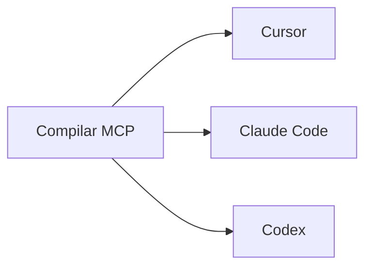

# Recetas de setup por cliente

## Propósito

Esta guía entrega recetas exactas y copiables para los principales clientes IA locales usados con este framework.

## Mapa de setup por cliente



## Regla compartida

- Abre este repositorio como raíz del workspace.
- Compila primero:

```bash
npm install
npm run build
```

## Cursor

Archivo de configuración:
- `~/.cursor/mcp.json`

Ejemplo:

```json
{
  "mcpServers": {
    "sdd": {
      "type": "stdio",
      "command": "node",
      "args": [
        "/RUTA/ABSOLUTA/A/spec-driven-development-template/packages/sdd-mcp/dist/index.js"
      ]
    }
  }
}
```

Validación:
- reinicia Cursor
- confirma que el servidor `sdd` aparece listado
- pide al agente leer `sdd://policy/current`

## Claude Code

Configuración por proyecto:
- `.mcp.json`

Configuración por usuario:
- `~/.claude.json`

Ejemplo por proyecto:

```json
{
  "mcpServers": {
    "sdd": {
      "command": "node",
      "args": [
        "/RUTA/ABSOLUTA/A/spec-driven-development-template/packages/sdd-mcp/dist/index.js"
      ],
      "env": {}
    }
  }
}
```

Validación:
- abre el repositorio
- confirma que Claude accede al servidor `sdd`
- pídele listar tools y leer el resource de quickstart

## Codex

Archivo de configuración:
- `~/.codex/config.toml`

Ejemplo:

```toml
[mcp_servers.sdd]
command = "node"
args = ["/RUTA/ABSOLUTA/A/spec-driven-development-template/packages/sdd-mcp/dist/index.js"]
```

Validación:
- reinicia Codex
- confirma que el servidor está disponible
- pídele usar `sdd_validate` o leer `sdd://docs/quickstart`

## Prompt inicial recomendado

```text
Usa el servidor MCP sdd conectado para este repositorio.
Crea primero la base SDD.
Prefiere ./www/<nombre-proyecto> como espacio recomendado por defecto; también se soportan rutas externas.
Lee los resources de policy y quickstart antes de hacer cambios.
No implementes código antes de spec aprobada y plan consistente.
```
