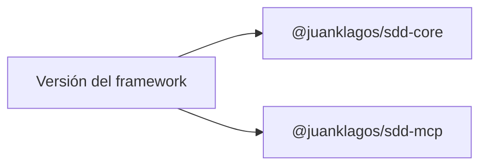

# Estrategia de versionado

## Propósito

Cómo se versionan el framework y sus paquetes internos, y por qué van siempre al mismo número.

## Mapa de alineación de versiones

## Regla actual

- la versión pública canónica es la release del repositorio
- `@juanklagos/sdd-core` y `@juanklagos/sdd-mcp` deben mantenerse alineados con la release minor del repositorio

Alineación actual:
- framework: `1.7.0`
- `@juanklagos/sdd-core`: `1.7.0`
- `@juanklagos/sdd-mcp`: `1.7.0`

## Política práctica de releases

### Patch

Usa releases patch para:
- fixes de documentación
- fixes de CI
- fixes de scripts no rompientes
- fixes MCP no rompientes

### Minor

Usa releases minor para:
- nuevos tools
- nuevos resource templates
- nuevos flujos de onboarding
- nuevos ejemplos
- nuevas guías que mejoran materialmente la adopción

### Major

Usa releases major para:
- cambios rompientes en workflow
- cambios rompientes en policy/gate
- cambios rompientes en contratos MCP
- cambios rompientes en la estructura de paquetes

## Regla para paquetes

- los paquetes están publicados en npm: `@juanklagos/sdd-core`, `@juanklagos/sdd-mcp` y `@juanklagos/create-sdd-project`
- sus versiones siguen la release del framework (un solo número para todo el repositorio), así `npx @juanklagos/create-sdd-project` siempre coincide con el flujo documentado
- conserva semver y registra cada cambio visible en los paquetes en el `CHANGELOG.md` del repositorio
