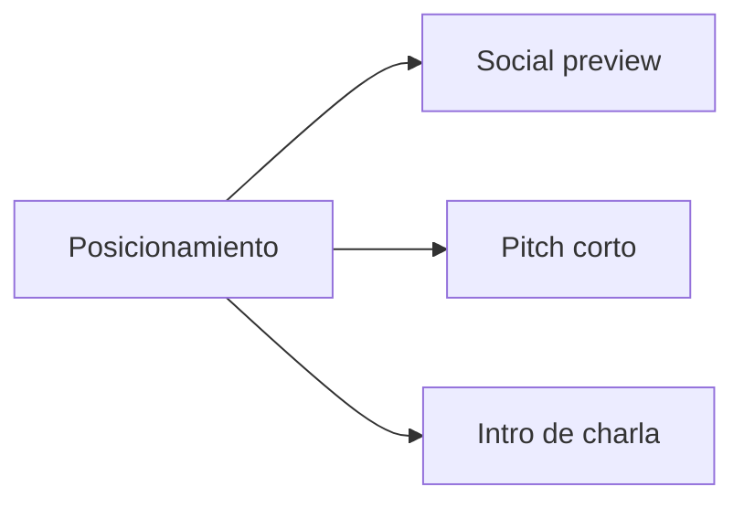

# Kit de medios

## Propósito

Esta página centraliza assets reutilizables de cara al público para posts, preview del repositorio, charlas y posicionamiento del producto.

## Estructura de medios



## Social preview

Asset sugerido:
- `docs/assets/social-preview.svg`

Tamaño recomendado para GitHub social preview:
- `1280 x 640`

## Frase de posicionamiento

Usa esto como descriptor corto:

```text
Framework operativo de SDD con guía para IA y soporte MCP.
```

## Pitch corto

```text
Spec-Driven Development Template ayuda a pasar de idea a implementación con menos fricción.
Combina un framework de arranque, reglas multi-agente, documentación guiada y una capa MCP local para flujos operativos.
```

## Intro para charla o sesión

```text
Este proyecto no es solo un template de documentación. Es un framework operativo para Spec-Driven Development.
Guía tanto a usuarios técnicos como no técnicos, deja ./www/<nombre-proyecto> como default limpio cuando el proyecto vive dentro del template, sigue soportando rutas externas y da a los asistentes de IA un flujo consistente mediante policy, specs, disciplina de bitácora y tooling MCP.
```

## Checklist visual

- Usa el social preview como imagen de preview del repositorio
- Combínalo con una captura o gif del flujo MCP
- Mantén el mensaje centrado en reducir fricción y lograr ejecución consistente asistida por IA

## Siguiente asset sugerido

- demo de terminal de 30-45 segundos:
  - compilar MCP
  - conectar cliente
  - crear workspace
  - crear spec
  - validar y pasar compuerta
