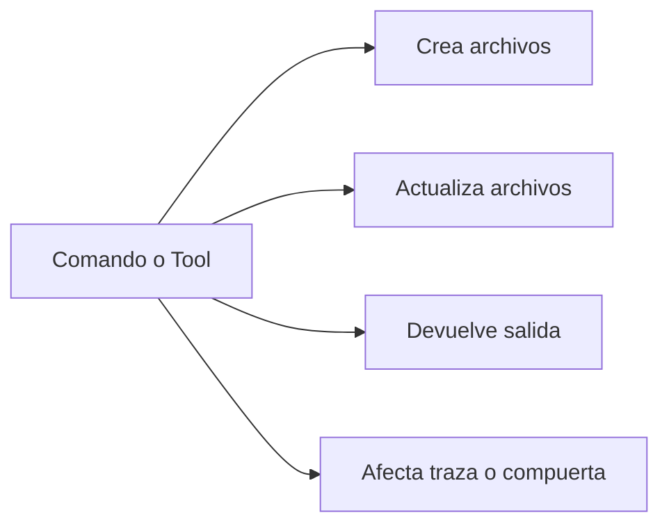

# Referencia de resultados por comando

## Propósito

Esta guía documenta qué crea, qué modifica y qué devuelve cada script principal y cada tool MCP.

Para la visión completa de MCP, intención de tools, resources y prompts, empieza aquí:
- [Referencia completa de MCP](./41-referencia-completa-mcp.md)

## Modelo de resultado

## Scripts de workspace e inicialización

### `./scripts/create-www-project.sh <nombre-proyecto> <assistant> [flags]`

Úsalo cuando:
- quieres el workspace recomendado por defecto dentro de este template

Crea:
- `./www/<nombre-proyecto>/`
- la estructura base SDD dentro de esa carpeta
- setup opcional de Spec Kit, si está disponible

Modifica:
- nada fuera de la carpeta nueva del workspace

Resultado exitoso:
- imprime la ruta absoluta del workspace
- imprime el perfil elegido
- imprime los siguientes comandos sugeridos

### `./scripts/init-project.sh /ruta/absoluta/proyecto --profile=recommended`

Úsalo cuando:
- el usuario quiere el proyecto ejecutable fuera de este template

Crea:
- la base SDD completa en la ruta destino
- `idea/`, `specs/`, `bitacora/`, `.sdd/` y archivos auxiliares

Reglas:
- rechaza la raíz del template
- si la ruta destino vive dentro de este template, debe estar bajo `./www/`

Resultado exitoso:
- imprime la ruta inicializada
- imprime el perfil elegido
- imprime los siguientes comandos para continuar

### `./scripts/init-project-with-spec-kit.sh /ruta/absoluta/proyecto codex --profile=recommended`

Úsalo cuando:
- quieres una ruta externa más inicialización de GitHub Spec Kit

Crea:
- todo lo de `init-project.sh`
- configuración de Spec Kit para el asistente elegido

Resultado exitoso:
- imprime la ruta inicializada
- imprime el flujo sugerido de Spec Kit

## Scripts de specs y trazabilidad

### `./scripts/new-spec.sh "feature-name" "Owner"`

Crea:
- `specs/NNN-feature-name/`
- `spec.md`
- `plan.md`
- `tasks.md`
- `research.md`
- `history.md`
- `contracts/README.md`

Modifica:
- agrega una fila a `specs/INDEX.md`

Resultado exitoso:
- imprime `Created: specs/NNN-feature-name`
- imprime `Added row to specs/INDEX.md`

### `./scripts/confirm-user-consent.sh "User approved scope X"`

Crea o actualiza:
- `.sdd/user-consent.log`

Resultado exitoso:
- imprime la ruta del archivo de log donde quedó el consentimiento

### `./scripts/generate-status.sh`

Crea o reemplaza:
- `STATUS.md`

Lee:
- `specs/INDEX.md`
- todos los `tasks.md`
- `bitacora/global/PROJECT_LOG.md` si existe

Resultado exitoso:
- imprime `Generated STATUS.md`

### `./scripts/generate-roadmap.sh`

Crea o reemplaza:
- `docs/roadmap.mmd`
- `docs/roadmap.md`

Lee:
- `specs/INDEX.md`

Resultado exitoso:
- imprime las rutas generadas del roadmap

## Scripts de validación

### `./scripts/validate-sdd.sh . --strict`

Chequea:
- carpetas y archivos requeridos
- integridad del bundle template
- carpetas numeradas de spec
- disciplina estricta de `history.md` cuando Git está disponible

Resultado exitoso:
- imprime líneas `[OK]`, `[WARN]` y `[FAIL]`
- termina con `Summary: X error(s), Y warning(s).`
- sale con código distinto de cero si existe algún error

### `./scripts/check-sdd-policy.sh .`

Chequea:
- `sdd.policy.yaml`
- archivos de reglas requeridos
- referencias a la fuente canónica
- frase de hard-stop
- frase de workspace recomendado por defecto

Resultado exitoso:
- imprime líneas `[OK]`, `[WARN]` y `[FAIL]`
- termina con `SDD Policy summary: X error(s), Y warning(s).`
- sale con código distinto de cero si existe algún error

### `./scripts/check-sdd-gate.sh .`

Chequea:
- estado de aprobación de specs
- señales de consistencia del plan
- presencia de tareas
- exigencia de consentimiento cuando existen specs aprobadas

Resultado exitoso:
- imprime el estado de la compuerta y sus mensajes de validación
- sale con código distinto de cero si la compuerta de implementación debe seguir cerrada

## Tools MCP

### `sdd_create_workspace`

Alcance:
- solo workspace administrado
- crea `./www/<nombre-proyecto>/` dentro de este template

Salida estructurada:
- `projectRoot`
- `profile`
- `assistant`
- `usedSpecKit`

### `sdd_create_spec`

Alcance:
- se permite cualquier ruta de proyecto destino
- si la ruta vive dentro de este template, debe estar bajo `./www/`

Salida estructurada:
- `specId`
- `specDir`
- `indexUpdated`

### `sdd_validate`

Salida estructurada:
- `ok`
- `errors`
- `warnings`
- `messages[]`

### `sdd_check_gate`

Salida estructurada:
- `ok`
- `errors`
- `warnings`
- `approvedSpecs`
- `totalSpecs`
- `messages[]`

### `sdd_record_user_consent`

Salida estructurada:
- `logFile`
- `summary`
- `timestamp`

### `sdd_list_specs`

Salida estructurada:
- `specs[]`
  - `id`
  - `dir`
  - `status`

### `sdd_generate_status`

Salida estructurada:
- `path`
- `content`

Efecto lateral:
- crea o reemplaza `STATUS.md`

### `sdd_generate_roadmap`

Salida estructurada:
- `mermaidPath`
- `markdownPath`
- `mermaid`
- `markdown`

Efectos laterales:
- crea o reemplaza `docs/roadmap.mmd`
- crea o reemplaza `docs/roadmap.md`

### `sdd_append_project_log`

Salida estructurada:
- `path`
- `content`

Efecto lateral:
- agrega contenido a `bitacora/global/PROJECT_LOG.md`

### `sdd_write_daily_log`

Salida estructurada:
- `path`
- `content`

Reglas:
- `date` debe usar `YYYY-MM-DD`

Efecto lateral:
- crea o reemplaza `bitacora/diaria/YYYY-MM-DD.md`

### `sdd_write_handoff`

Salida estructurada:
- `path`
- `content`

Reglas:
- `fileName` debe ser un nombre simple markdown como `2026-03-18-handoff.md`

Efecto lateral:
- crea o reemplaza `bitacora/handoffs/<fileName>`

### `sdd_write_decision`

Salida estructurada:
- `path`
- `content`

Reglas:
- `fileName` debe ser un nombre simple markdown como `2026-03-18-decision.md`

Efecto lateral:
- crea o reemplaza `bitacora/decisiones/<fileName>`

## Regla práctica

- Usa `./www/<nombre-proyecto>/` como default limpio cuando el proyecto ejecutable debe vivir dentro de este template.
- Usa `init-project.sh` o `init-project-with-spec-kit.sh` con ruta absoluta cuando el usuario quiere el proyecto ejecutable en otro lugar.
- Nunca inicialices el proyecto ejecutable en la raíz del template.
