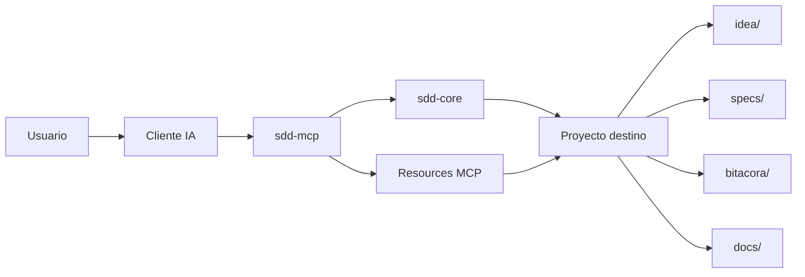

# Referencia completa de MCP

## Propósito

La referencia completa del servidor local `sdd-mcp`, escrita desde el punto de vista de quien lo usa.

Usa esta página cuando necesites saber:
- para qué sirve el servidor MCP
- qué tools, resources y prompts expone
- qué hace cada operación
- qué efectos laterales produce
- qué puede esperar el usuario como salida

La instalación y la conexión están en [33-guia-servidor-mcp.md](./33-guia-servidor-mcp.md), y los resultados script por script en [40-referencia-resultados-comandos.md](./40-referencia-resultados-comandos.md). Si no eres técnico, empieza por [43-guia-mcp-facil.md](./43-guia-mcp-facil.md) en vez de por esta página.

## Qué es `sdd-mcp`

`sdd-mcp` es la capa MCP operativa de este framework.

Da a los clientes IA una forma estructurada de:
- crear o inicializar workspaces SDD
- crear e inspeccionar specs
- validar el estado SDD de un proyecto
- aplicar la compuerta de implementación
- escribir artefactos de trazabilidad
- leer contexto clave del proyecto a través de resources MCP

También sirve la documentación del framework, pero lo que importa son las operaciones: un agente conduce el proyecto a través de esta interfaz.

## Arquitectura visual

Ruta de lectura:
- el cliente IA lee resources y prompts MCP
- `sdd-mcp` expone el contrato operativo
- `sdd-core` ejecuta las mutaciones reales del proyecto
- el proyecto destino guarda los artefactos SDD resultantes

## Qué puede esperar el usuario

Cuando un cliente IA está conectado a `sdd-mcp`, el usuario puede esperar:
- salidas estructuradas en vez de texto ambiguo
- escrituras determinísticas para status, roadmap, bitácora y trazabilidad
- chequeos explícitos de compuerta antes de implementar
- la opción de usar el workspace limpio por defecto en `./www/<nombre-proyecto>/`
- soporte para rutas externas en los tools basados en `projectRoot`

## Reglas de alcance

- Workspace recomendado por defecto dentro de este template: `./www/<nombre-proyecto>/`
- También se soportan rutas externas para tools que reciben `projectRoot`
- El proyecto ejecutable nunca debe inicializarse en la raíz del template
- Si un proyecto destino vive dentro de este template, debe vivir bajo `./www/`

## Transportes

Transportes soportados:
- `stdio`
- `Streamable HTTP`

Entrypoints:
- stdio: `packages/sdd-mcp/dist/index.js`
- HTTP: `http://127.0.0.1:3334/mcp`

## Referencia de tools

### `sdd_create_workspace`

Propósito:
- crear un workspace ejecutable administrado bajo `./www/<nombre-proyecto>/`

Cuándo usarlo:
- cuando el usuario quiere el workspace recomendado por defecto dentro de este template

Entrada:
- `projectName`
- `assistant`
- `profile`
- `useSpecKit`

Qué hace:
- crea la base SDD del workspace
- opcionalmente inicializa Spec Kit

Qué debe esperar el usuario:
- una carpeta de proyecto limpia bajo `./www/`
- ningún cambio fuera de ese workspace administrado

Salida estructurada:
- `projectRoot`
- `profile`
- `assistant`
- `usedSpecKit`

### `sdd_create_spec`

Propósito:
- crear la siguiente carpeta numerada de spec a partir del bundle template

Cuándo usarlo:
- cuando el proyecto destino ya tiene la base SDD y necesita una nueva spec de feature

Entrada:
- `projectRoot`
- `featureName`
- `owner`

Qué hace:
- crea `spec.md`, `plan.md`, `tasks.md`, `research.md`, `history.md`
- crea `contracts/README.md`
- agrega una fila en `specs/INDEX.md`

Salida estructurada:
- `specId`
- `specDir`
- `indexUpdated`

### `sdd_validate`

Propósito:
- validar la estructura SDD y los archivos requeridos de un proyecto destino

Cuándo usarlo:
- antes de cerrar una sesión
- antes de confiar en un proyecto migrado o recién inicializado

Entrada:
- `projectRoot`

Qué hace:
- verifica carpetas requeridas
- verifica archivos requeridos
- verifica bundles numerados de spec

Salida estructurada:
- `ok`
- `errors`
- `warnings`
- `messages[]`

### `sdd_check_gate`

Propósito:
- decidir si la implementación está permitida bajo las reglas SDD

Cuándo usarlo:
- inmediatamente antes de implementar

Entrada:
- `projectRoot`

Qué hace:
- revisa estado de aprobación
- revisa señales de consistencia del plan
- revisa presencia de tareas
- revisa exigencia de consentimiento cuando existen specs aprobadas

Salida estructurada:
- `ok`
- `errors`
- `warnings`
- `approvedSpecs`
- `totalSpecs`
- `messages[]`

### `sdd_record_user_consent`

Propósito:
- registrar aprobación explícita del usuario antes de iniciar implementación

Cuándo usarlo:
- solo cuando la implementación realmente va a comenzar

Entrada:
- `projectRoot`
- `summary`

Qué hace:
- agrega una línea con timestamp en `.sdd/user-consent.log`

Salida estructurada:
- `logFile`
- `summary`
- `timestamp`

### `sdd_list_specs`

Propósito:
- listar las specs numeradas y su estado

Cuándo usarlo:
- para elegir la spec activa de una sesión

Entrada:
- `projectRoot`

Qué hace:
- lee las specs numeradas
- extrae el estado de aprobación desde `spec.md`

Salida estructurada:
- `specs[]`
  - `id`
  - `dir`
  - `status`

### `sdd_generate_status`

Propósito:
- construir un dashboard de estado del proyecto

Cuándo usarlo:
- al cierre de sesión
- antes de un handoff

Entrada:
- `projectRoot`

Qué hace:
- crea o reemplaza `STATUS.md`
- resume specs activas
- resume progreso de tareas
- incluye extracto reciente del log global

Salida estructurada:
- `path`
- `content`

### `sdd_generate_roadmap`

Propósito:
- generar un roadmap a partir de `specs/INDEX.md`

Cuándo usarlo:
- cuando el usuario quiere un roadmap visual y otro en markdown

Entrada:
- `projectRoot`

Qué hace:
- crea o reemplaza `docs/roadmap.mmd`
- crea o reemplaza `docs/roadmap.md`

Salida estructurada:
- `mermaidPath`
- `markdownPath`
- `mermaid`
- `markdown`

### `sdd_append_project_log`

Propósito:
- agregar una entrada al log global del proyecto

Cuándo usarlo:
- para registrar cambios de alto nivel de una sesión

Entrada:
- `projectRoot`
- `entry`

Qué hace:
- agrega contenido a `bitacora/global/PROJECT_LOG.md`

Salida estructurada:
- `path`
- `content`

### `sdd_write_daily_log`

Propósito:
- crear o reemplazar un archivo de bitácora diaria

Cuándo usarlo:
- para guardar la nota de sesión de una fecha

Entrada:
- `projectRoot`
- `date`
- `content`

Reglas:
- `date` debe usar `YYYY-MM-DD`

Qué hace:
- crea o reemplaza `bitacora/diaria/YYYY-MM-DD.md`

Salida estructurada:
- `path`
- `content`

### `sdd_write_handoff`

Propósito:
- crear o reemplazar un archivo de handoff

Cuándo usarlo:
- cuando una sesión deja un siguiente paso claro para otro operador o agente

Entrada:
- `projectRoot`
- `fileName`
- `content`

Reglas:
- `fileName` debe ser un nombre simple markdown

Qué hace:
- crea o reemplaza `bitacora/handoffs/<fileName>`

Salida estructurada:
- `path`
- `content`

### `sdd_write_decision`

Propósito:
- crear o reemplazar un registro de decisión

Cuándo usarlo:
- cuando la sesión toma una decisión importante del proyecto

Entrada:
- `projectRoot`
- `fileName`
- `content`

Reglas:
- `fileName` debe ser un nombre simple markdown

Qué hace:
- crea o reemplaza `bitacora/decisiones/<fileName>`

Salida estructurada:
- `path`
- `content`

### `sdd_board_read`

Propósito:
- leer el board visual del SDD Builder de un proyecto destino

Cuándo usarlo:
- cuando la IA necesita el layout del lienzo más cada spec con estado y progreso de tareas

Entrada:
- `projectRoot`

Qué hace:
- lee `specs/board.canvas` (JSON Canvas), generando un layout por defecto si falta
- lista las specs con estado de aprobación y conteo de tareas hechas/totales

Qué debe esperar el usuario:
- exactamente la misma vista que renderiza el lienzo `/builder`

Salida estructurada:
- `canvas` (nodes, edges)
- `specs` (id, dir, status, tasks)

### `sdd_board_write`

Propósito:
- reemplazar el layout del lienzo del board

Cuándo usarlo:
- cuando la IA organiza o reordena tarjetas y uniones en conjunto

Reglas:
- solo se guarda layout; los archivos markdown nunca se tocan

Qué hace:
- valida y escribe atómicamente `specs/board.canvas`

Entrada:
- `projectRoot`
- `canvas`

Salida estructurada:
- `ok`
- `nodes`
- `edges`

### `sdd_board_connect`

Propósito:
- conectar dos tarjetas existentes del board con una unión etiquetada opcional

Cuándo usarlo:
- cuando la IA registra una dependencia o relación entre tarjetas

Reglas:
- ambos ids de nodo deben existir en el board
- las uniones idénticas no se duplican (idempotente)

Entrada:
- `projectRoot`
- `fromNode`
- `toNode`
- `label`

Salida estructurada:
- `canvas`

### `sdd_read_tasks`

Propósito:
- leer las tareas checkbox del `tasks.md` de una spec

Cuándo usarlo:
- antes de marcar una tarea, para obtener números de línea y estado

Entrada:
- `projectRoot`
- `specId`

Salida estructurada:
- `specId`
- `tasks` (text, done, line)

### `sdd_set_task_done`

Propósito:
- marcar o desmarcar una línea checkbox del `tasks.md` de una spec

Cuándo usarlo:
- cuando una tarea se completa o se reabre durante una sesión

Reglas:
- edición quirúrgica de la única línea `- [ ]` / `- [x]`, escritura atómica
- `line` viene de `sdd_read_tasks`

Entrada:
- `projectRoot`
- `specId`
- `line`
- `done`

Salida estructurada:
- `specId`
- `tasks`

### `sdd_gate_summary`

Propósito:
- semáforo del gate en una sola llamada: el chequeo de compuerta más la validación estructural, con cada mensaje agrupado por la spec a la que pertenece

Cuándo usarlo:
- cuando quieres el estado completo del workspace en una sola llamada (es el dato detrás del chip de gate del SDD Builder y de los badges por tarjeta)

Reglas:
- misma capa `sdd-core` que la ruta REST `/api/gate` — no hay una segunda copia de la regla
- `dependencyWarnings` son solo avisos (una spec aprobada que depende de una no aprobada), nunca errores de compuerta

Entrada:
- `projectRoot`

Salida estructurada:
- `ok`
- `errors`, `warnings` (conteos)
- `messages` agrupados por spec
- `dependencyWarnings`

### `sdd_approve_spec`

Propósito:
- rellenar quirúrgicamente el bloque de aprobación existente de un `spec.md`

Cuándo usarlo:
- cuando la persona que decide aprobó la spec y hay que dejar la evidencia en disco antes de implementar

Reglas:
- escribe `Estado` -> `Aprobado`, fecha de aprobación -> hoy, aprobador -> el nombre indicado
- `evidence` siempre gana cuando se entrega; sin él, una línea de evidencia existente nunca se sobrescribe
- falla con un error bilingüe claro cuando falta el bloque `## Estado de aprobación / Approval status` — copia primero el bloque desde `specs/_template/spec.md`
- la tool registra la decisión, no la toma: aprobar es siempre un acto humano

Entrada:
- `projectRoot`
- `specId`
- `approver`
- `evidence` (opcional)

Salida estructurada:
- `specId`
- `status`
- `approvalDate`
- `approver`
- `evidenceUpdated`
- `fieldsUpdated`

### `sdd_update_spec_sections`

Propósito:
- reemplazar **solo** el contenido bajo los encabezados del editor guiado de un `spec.md`, preservando todo lo demás

Cuándo usarlo:
- cuando llenas o refinas una spec desde un editor guiado o desde la conversación, sin reescribir el archivo completo

Reglas:
- lectura-modificación-escritura quirúrgica, atómica y serializada: dos guardados concurrentes hacen cola en vez de pisarse
- el bloque de aprobación siempre se preserva
- tolerante a los encabezados EN/ES de la plantilla del repo; un encabezado que el archivo no tiene se agrega al final con su título bilingüe canónico y se reporta en `created`

Entrada:
- `projectRoot`
- `specId`
- `story` (opcional, texto libre)
- `scenarios`, `criteria`, `requirements`, `properties`, `successCriteria` (opcionales, listas)
- `outOfScope` (opcional, texto libre)

Salida estructurada:
- `specId`
- `updated` (secciones reemplazadas en su lugar)
- `created` (secciones agregadas porque el archivo no las tenía)

### `sdd_read_spec_document`

Propósito:
- leer un documento del bundle de una spec (`spec.md`, `plan.md`, `tasks.md`, `research.md` o `history.md`) como markdown crudo

Cuándo usarlo:
- cuando el agente está conectado por HTTP/Desk (sin filesystem) y necesita el contenido real de la spec — la contraparte de lectura de `sdd_approve_spec` y `sdd_update_spec_sections`

Entrada:
- `projectRoot`
- `specId`
- `document` (uno de los cinco documentos del bundle)

Salida estructurada:
- `specId`, `document`, `content`

### `sdd_read_bitacora`

Propósito:
- leer la bitácora: sin `fileName` lista los `.md` de una carpeta (`handoffs`, `decisiones`, `diaria`, `global`), con `fileName` devuelve el contenido

Cuándo usarlo:
- al retomar una sesión (leer el último handoff — la lista viene ordenada, el último es el más reciente) o al revisar decisiones previas

Reglas:
- `fileName` debe ser un nombre plano `.md` (sin separadores de ruta); todo intento de traversal falla con error claro

Entrada:
- `projectRoot`
- `kind` (`handoffs` | `decisiones` | `diaria` | `global`)
- `fileName` (opcional)

Salida estructurada:
- `kind`, `files`, y con `fileName`: `content`

### `sdd_check_drift`

Propósito:
- responder si el código que gobierna una spec cambió DESPUÉS de su fecha de aprobación (semáforo de deriva, spec 025)

Cuándo usarlo:
- antes de tocar código gobernado por una spec aprobada, o al auditar el estado del proyecto

Reglas:
- estados: `clean`, `drifted` (con los commits ofensores), `unscoped` (sin File scope declarado), `unknown` (no aprobada / sin git)
- misma regla `computeSpecDrift` que el board y el dashboard — nunca inventa un `clean`

Entrada:
- `projectRoot`
- `specId` (opcional; sin él, reporta todas las specs)

Salida estructurada:
- `reports` (specId, status, drift)

### `sdd_add_task`

Propósito:
- añadir una tarea sin marcar (`- [ ] texto`) al `tasks.md` de una spec

Cuándo usarlo:
- durante la planificación, cuando aparece trabajo nuevo que debe quedar en la spec

Reglas:
- la tarea entra justo después del último checkbox (o al final si no hay); escritura atómica, misma primitiva que `sdd_set_task_done`

Entrada:
- `projectRoot`
- `specId`
- `text` (una sola línea, sin el checkbox)

Salida estructurada:
- `specId`, `tasks` actualizadas con números de línea

### `sdd_lint_ears`

Propósito:
- lintear criterios de aceptación contra el esqueleto EARS (CUANDO/SI/MIENTRAS … EL SISTEMA DEBERÁ …) y palabras vagas sin número

Cuándo usarlo:
- al redactar criterios antes de guardarlos con `sdd_update_spec_sections`

Reglas:
- puro (sin filesystem) y consultivo: los resultados son sugerencias, nunca bloquean
- el mismo `validateEarsCriterion` que usa el Builder

Entrada:
- `criteria` (lista de líneas)

Salida estructurada:
- `results` (criterion, level, matchesPattern, vagueWords, hints)

### `sdd_score_spec`

Propósito:
- puntuar un bundle de spec 0-100 con nota (A/B/C/D) y observaciones de mejora

Cuándo usarlo:
- para evaluar si una spec está lista antes de pedir aprobación

Reglas:
- mismas heurísticas que `scripts/score-spec.sh` (archivos presentes, secciones, plan, tareas, research, history con fechas)

Entrada:
- `projectRoot`
- `specId` (opcional; sin él, puntúa todas)

Salida estructurada:
- `scores` (specId, score, grade, notes)

### `sdd_install_sidecar`

Propósito:
- instalar el sidecar compacto `spec/` en un proyecto externo EXISTENTE (el layout recomendado para proyectos reales fuera del template)

Cuándo usarlo:
- como primer paso para adoptar SDD en un proyecto existente desde Desk o `npx`, sin bash ni clone del template

Reglas:
- delega en `scripts/install-spec-sidecar.sh` (el instalador probado); rechaza la raíz del template como todas las herramientas
- después de instalarlo, el resto de herramientas funciona contra ese `projectRoot`

Entrada:
- `targetPath` (directorio existente)
- `profile` (`minimal` | `recommended`)

Salida estructurada:
- `projectRoot`, `sddRoot`, `profile`

### `sdd_board_app`

Propósito:
- mostrar el board SDD visual **dentro del cliente** como MCP App (SEP-1865, extensión oficial `ext-apps`)

Cuándo usarlo:
- cuando el usuario quiere *ver* el board (tarjetas, uniones, semáforo del gate, avisos de dependencias) sin salir del chat

Reglas:
- vista de solo lectura; vinculada al recurso `ui://sdd/board.html` vía `_meta.ui.resourceUri` (`text/html;profile=mcp-app`)
- los hosts sin soporte de MCP Apps reciben igualmente los datos completos de board + gate como texto JSON
- un gate cerrado es dato de la vista, nunca un error de la tool

Entrada:
- `projectRoot`

Salida estructurada:
- `projectRoot`
- `board` (canvas + specs, misma forma que `sdd_board_read`)
- `gate` (misma forma que `sdd_gate_summary`)

## Referencia de resources

### Resources estáticos

#### `sdd-policy`
- lee la política actual del framework
- úsalo cuando la IA necesita primero las reglas duras

#### `sdd-ai-start`
- lee la guía rápida de onboarding para IA
- úsalo cuando el operador arranca desde cero

#### `sdd-easy-mcp-guide`
- lee la guía amigable y no técnica de MCP
- úsalo cuando el operador quiere primero la explicación más fácil posible

#### `sdd-quickstart`
- lee la guía corta de quickstart
- úsalo cuando el operador necesita la ruta más corta posible

#### `sdd-spec-template`
- lee la plantilla base de `spec.md`
- úsalo cuando la IA necesita entender la estructura esperada de una spec

### Resource templates de workspace administrado

Estos resource templates son para proyectos administrados bajo `./www/<nombre-proyecto>/`.

#### `sdd-project-index`
- devuelve `specs/INDEX.md`
- espera una vista superior de las specs del proyecto

#### `sdd-project-log`
- devuelve `bitacora/global/PROJECT_LOG.md`
- espera el log global del proyecto

#### `sdd-project-latest-handoff`
- devuelve el archivo más reciente en `bitacora/handoffs/`
- espera el último handoff, si existe

#### `sdd-project-idea`
- devuelve `idea/IDEA_GENERAL.md`
- espera la intención y alcance del proyecto

#### `sdd-spec-document`
- devuelve un documento específico de una spec por id y nombre de archivo
- documentos soportados:
  - `spec.md`
  - `plan.md`
  - `tasks.md`
  - `research.md`
  - `history.md`

### URIs de recursos / Resource URIs

Lee un recurso con `resources/read` usando su URI exacta. Recursos estáticos:

| URI | Qué devuelve |
|---|---|
| `sdd://policy/current` | `sdd.policy.yaml` — la política legible por máquina |
| `sdd://docs/quickstart` | `QUICKSTART.md` |
| `sdd://docs/ai-start` | `AI_START_HERE.md` |
| `sdd://docs/easy-mcp` | The easy MCP guide (43) |
| `sdd://templates/spec` | La plantilla de spec que usa `sdd_create_spec` |

Plantillas por proyecto — sustituye `{projectName}` por el nombre del workspace, y `{specId}` / `{document}` (`spec.md`, `plan.md`, `tasks.md`, `research.md`, `history.md`):

| URI template |
|---|
| `sdd://project/{projectName}/index` |
| `sdd://project/{projectName}/idea` |
| `sdd://project/{projectName}/project-log` |
| `sdd://project/{projectName}/latest-handoff` |
| `sdd://project/{projectName}/specs/{specId}/{document}` |

### Rutas REST del builder / REST routes

El transporte HTTP también sirve la API del builder en el mismo puerto. Escucha solo en loopback y rechaza mutaciones cross-origin — ver las notas de seguridad en la guía 51.

| Método | Ruta | Para qué |
|---|---|---|
| GET | `/api/board` | El lienzo y cada spec con su estado y progreso |
| PUT | `/api/board` | Guarda el layout del lienzo (`specs/board.canvas`) |
| GET | `/api/gate` | Resumen de la compuerta, errores por spec y avisos de dependencias |
| GET | `/api/events` | Stream SSE de cambios del workspace (sync en vivo) |
| POST | `/api/spec` | Crea un paquete de spec real |
| GET | `/api/spec/:id` | Una spec: documentos y tareas parseadas |
| PUT | `/api/spec/:id/tasks` | Marca/desmarca una tarea en `tasks.md` |
| PUT | `/api/spec/:id/sections` | Reescribe secciones de spec.md (quirúrgico) |
| POST | `/api/spec/:id/approve` | Rellena el bloque de aprobación |
| POST | `/api/spec/:id/issues` | Crea issues de GitHub para las tareas pendientes (requiere `gh`) |

## Referencia de prompts

### `start_new_sdd_project`
- úsalo cuando el usuario quiere iniciar un proyecto nuevo desde este framework
- espera que la IA cree primero la base SDD y posponga implementación hasta que la compuerta esté cumplida

### `easy_start_project`
- úsalo cuando el usuario quiere iniciar un proyecto con guía tipo niño de 10 años
- espera que la IA explique acción, archivos tocados, resultado esperado y siguiente paso

### `easy_create_spec`
- úsalo cuando el usuario dice algo como `/create-spec pagos`
- espera que la IA cree el paquete de spec y explique el resultado con lenguaje simple

### `easy_show_structure`
- úsalo cuando el usuario se siente perdido y necesita el mapa de carpetas explicado fácil
- espera que la IA describa la estructura del proyecto como un mapa básico

### `easy_validate_project`
- úsalo cuando el usuario quiere validación y estado de compuerta en lenguaje simple
- espera que la IA traduzca warnings y errores a un único siguiente paso claro

### `easy_show_next_step`
- úsalo cuando el usuario quiere el siguiente paso SDD seguro sin jerga
- espera que la IA elija un solo siguiente paso exacto

### `adapt_existing_project_to_sdd`
- úsalo cuando el usuario ya tiene un proyecto y quiere agregar estructura SDD
- espera que la IA preserve el comportamiento actual y agregue trazabilidad

### `close_sdd_session`
- úsalo al terminar una sesión
- espera un resumen con objetivo, cambios, validación, riesgos y próximo paso

### `easy_close_session`
- úsalo al terminar una sesión con usuario no técnico
- espera que la IA resuma en lenguaje simple y deje un solo siguiente paso exacto

## Flujo recomendado para el usuario

1. Conecta el servidor MCP.
2. Lee `sdd-policy` y `sdd-quickstart`.
3. Crea la base SDD con `sdd_create_workspace` o con scripts de bootstrap externo.
4. Crea la primera spec con `sdd_create_spec`.
5. Valida con `sdd_validate`.
6. Antes de implementar, ejecuta `sdd_check_gate`.
7. Si todo está aprobado, registra consentimiento con `sdd_record_user_consent`.
8. Cierra la sesión con status, logs y handoff según haga falta.

## Resumen de expectativa para el usuario

El usuario debe esperar que este MCP:
- guíe el trabajo SDD con estructura, no con improvisación
- cree archivos predecibles
- bloquee implementación cuando la documentación no está lista
- preserve trazabilidad entre sesiones
- haga que distintos clientes IA se comporten de forma más consistente sobre el mismo proyecto
