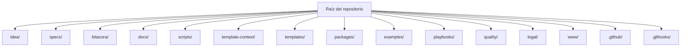

# Mapa de organización del proyecto

## Propósito

Este documento explica cómo está organizado el repositorio a nivel de carpetas.

No es un mapa de código.
Es un mapa operativo para humanos y agentes IA para que entiendan:
- qué pertenece a cada carpeta
- qué es solo del framework
- qué es material de ejecución del proyecto
- qué se edita con frecuencia
- qué debería mantenerse estable

## Regla de lectura

Hay dos niveles que debes entender:

1. **Raíz del framework**
   Este repositorio en sí mismo. Contiene el framework SDD reusable, el servidor MCP, las guías, los scripts y las plantillas.

2. **Proyecto destino**
   El proyecto ejecutable o adaptado que usa el framework. Dentro de este repositorio, el default limpio es `./www/<nombre-proyecto>/`. Fuera de este repositorio, el proyecto destino puede vivir en otra ruta elegida por el usuario.

## Organigrama organizativo

## Explicación carpeta por carpeta

### `idea/`

Rol:
- intención global del proyecto

Qué va aquí:
- la definición principal del proyecto
- problema, objetivo, alcance, audiencia, riesgos y criterio de finalización

Archivo principal:
- `idea/IDEA_GENERAL.md`

Cuándo se actualiza:
- cuando cambia la dirección general del proyecto

### `specs/`

Rol:
- columna vertebral de planeación y ejecución por feature

Qué va aquí:
- el índice de specs
- el bundle template reusable de specs
- una carpeta numerada por feature o línea de trabajo

Contenidos importantes:
- `specs/INDEX.md`
- `specs/README.md`
- `specs/_template/`
- `specs/001-.../`
- `specs/002-.../`

Cuándo se actualiza:
- cada vez que se define una nueva feature
- cada vez que cambian alcance, plan, tareas o historial

### `bitacora/`

Rol:
- trazabilidad y memoria de sesiones

Qué va aquí:
- log global del proyecto
- bitácoras diarias
- handoffs
- registros de decisión
- plantillas reutilizables para registrar trabajo

Subcarpetas:
- `bitacora/global/`
- `bitacora/diaria/`
- `bitacora/handoffs/`
- `bitacora/decisiones/`
- `bitacora/templates/`

Cuándo se actualiza:
- al cierre de cada sesión
- cuando se toma una decisión importante
- cuando otro agente u operador debe continuar el trabajo

### `docs/`

Rol:
- documentación para usuarios y guía del framework

Qué va aquí:
- onboarding
- guías por nivel
- documentación MCP
- roadmap, lanzamiento, versionado, legal y material de soporte

Subcarpetas importantes:
- `docs/en/`
- `docs/es/`
- `docs/assets/`

Cuándo se actualiza:
- cuando cambia el comportamiento del framework
- cuando las instrucciones visibles al usuario quedan obsoletas

### `scripts/`

Rol:
- automatización ejecutable del framework

Qué va aquí:
- scripts de inicialización
- scripts de validación
- generadores de status y roadmap
- smoke tests e integration tests de MCP

Ejemplos:
- `create-www-project.sh`
- `init-project.sh`
- `validate-sdd.sh`
- `check-sdd-policy.sh`
- `check-sdd-gate.sh`

Cuándo se actualiza:
- cuando cambia el workflow operativo
- cuando la automatización debe volverse más segura o consistente

### `template-context/`

Rol:
- instrucciones operativas base para agentes IA

Qué va aquí:
- reglas transversales entre agentes
- guía anti-misuso
- guía de compuerta de ejecución
- expectativas de handoff
- aceleradores de prompt

Subcarpetas importantes:
- `template-context/core-instructions/`
- `template-context/prompts/`

Cuándo se actualiza:
- cuando cambian las expectativas de comportamiento de la IA
- cuando nuevas reglas de agentes deben estandarizarse

### `templates/`

Rol:
- plantillas reutilizables para artefactos SDD

Qué va aquí:
- plantillas de idea
- plantillas de spec
- plantillas de bitácora

Subcarpetas:
- `templates/idea/`
- `templates/spec/`
- `templates/bitacora/`

Cuándo se actualiza:
- cuando cambia el wording o la estructura estándar de artefactos reutilizables

### `packages/`

Rol:
- capa de implementación productizada

Qué va aquí:
- código reusable tipado
- paquete del servidor MCP

Subcarpetas:
- `packages/sdd-core/`
- `packages/sdd-mcp/`

Significado:
- `sdd-core` contiene la lógica reusable
- `sdd-mcp` expone esa lógica a clientes IA por medio de MCP

Cuándo se actualiza:
- cuando cambia el comportamiento del framework en código
- cuando evolucionan tools, resources, prompts o transportes MCP

### `examples/`

Rol:
- ejemplos trabajados para adopción

Qué va aquí:
- proyectos de ejemplo
- adaptaciones de ejemplo
- flujos end-to-end de ejemplo

Cuándo se actualiza:
- cuando hace falta material pedagógico más claro
- cuando un nuevo patrón de uso debe demostrarse

### `playbooks/`

Rol:
- aceleradores por tipo de proyecto

Qué va aquí:
- guía específica por dominio para SaaS, e-commerce, mobile, backend API y contextos similares

Cuándo se actualiza:
- cuando una categoría de proyecto necesita ayuda operativa más directa

### `quality/`

Rol:
- soporte de evidencia y verificación de calidad

Qué va aquí:
- plantillas de evidencia
- material de apoyo orientado a calidad

Ruta importante:
- `quality/evidence/`

Cuándo se actualiza:
- cuando el framework necesita estándares de verificación más fuertes

### `legal/`

Rol:
- encuadre legal y de licencia

Qué va aquí:
- materiales legales y referencias asociadas a la licencia

Cuándo se actualiza:
- cuando cambia la postura legal del framework

### `www/`

Rol:
- espacio administrado de ejecución para proyectos destino dentro de este repositorio

Qué va aquí:
- proyectos ejecutables creados con la convención default del framework

Ejemplo:
- `www/mi-proyecto/`

Significado:
- esto no es código fuente del framework
- aquí debe vivir el trabajo del proyecto destino si permanece dentro de este repositorio

Cuándo se actualiza:
- cada vez que se crea un nuevo proyecto destino administrado

### `.github/`

Rol:
- automatización del repositorio y configuración de colaboración

Qué va aquí:
- workflows
- issue templates
- instrucciones específicas de GitHub

Subcarpetas importantes:
- `.github/workflows/`
- `.github/ISSUE_TEMPLATE/`

Cuándo se actualiza:
- cuando cambia CI, intake de issues o el comportamiento en GitHub

### `.githooks/`

Rol:
- automatización local de hooks Git

Qué va aquí:
- scripts de hooks usados para exigir validación antes de commits

Cuándo se actualiza:
- cuando cambian las guardas locales del repositorio

## Qué debería permanecer estable normalmente

Estas áreas son estructura del framework y no deberían cambiarse a la ligera:
- `template-context/`
- `templates/`
- `packages/`
- `scripts/`
- `docs/`
- `.github/`

## Qué cambia con frecuencia en trabajo real

Estas áreas se mueven más durante el uso normal:
- `idea/`
- `specs/`
- `bitacora/`
- `www/<nombre-proyecto>/`

## Interpretación práctica para agentes IA

- Si la tarea trata sobre mejorar el framework, trabaja en la estructura raíz del repositorio.
- Si la tarea trata sobre un proyecto del usuario, trabaja en la ruta del proyecto destino.
- Si ese proyecto destino vive dentro de este repositorio, usa `www/<nombre-proyecto>/` como default limpio.
- Nunca mezcles implementación ejecutable del proyecto dentro de la raíz del framework.

## Resumen corto

- `idea/` explica el proyecto.
- `specs/` define el trabajo.
- `bitacora/` preserva la traza.
- `docs/` enseña el sistema.
- `scripts/` automatizan el sistema.
- `template-context/` instruye el comportamiento de la IA.
- `templates/` estandariza artefactos reutilizables.
- `packages/` implementa el core productizado y MCP.
- `www/` aloja proyectos ejecutables administrados dentro de este repo.
