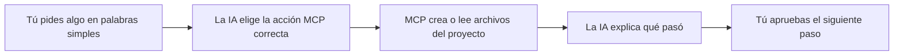
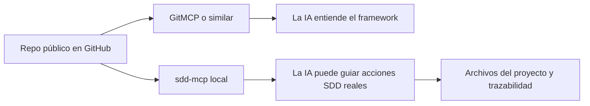
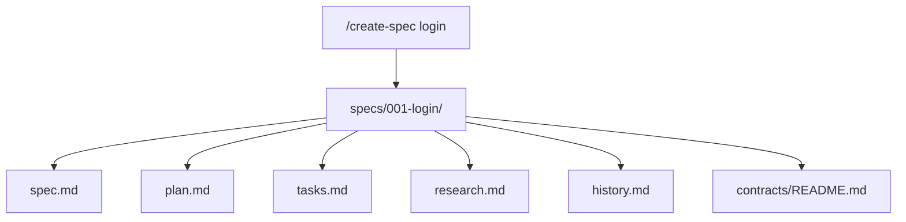
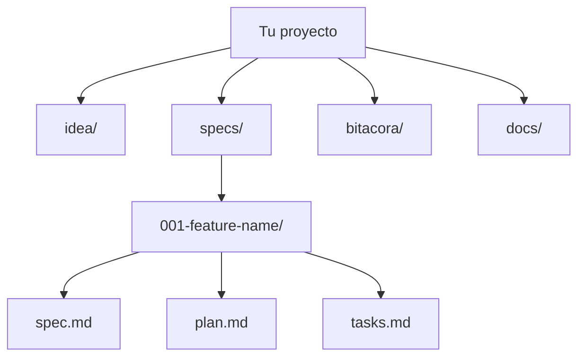
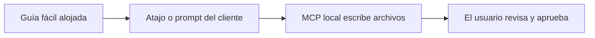

# Guía fácil de MCP para usuarios no técnicos

## Propósito

Esta guía explica cómo usar `sdd-mcp` de la forma más fácil posible.

Úsala cuando:
- no quieres pensar en detalles técnicos de instalación
- quieres hablar con la IA en lenguaje simple
- quieres comandos como `/create-spec pagos` explicados como si fueran un control remoto sencillo
- quieres saber exactamente qué va a crear, cambiar y devolver la IA

Mantén [41-referencia-completa-mcp.md](./41-referencia-completa-mcp.md) como referencia técnica completa.
Mantén [42-mapa-organizacion-proyecto.md](./42-mapa-organizacion-proyecto.md) como mapa completo carpeta por carpeta.

## La idea simple

Piensa en `sdd-mcp` así:
- la IA es la ayudante
- MCP es la caja de herramientas
- tu proyecto es la caja donde se guarda el trabajo
- cada acción crea o actualiza archivos muy concretos



## La forma más fácil de usarlo

Tienes 3 formas amigables de usar el MCP.

### 1. Lenguaje natural

Ejemplo:

```text
Ayúdame a empezar mi proyecto con SDD.
Mi proyecto es una app de tienda escolar.
Crea primero la base y guíame paso a paso.
```

### 2. Estilo comando fácil

Ejemplo:

```text
/create-spec login
```

Esto significa:
- crear una nueva spec numerada llamada `login`
- explicar qué archivos se crearon
- decirte qué debes revisar después

### 3. Selector de prompts dentro del cliente

Algunos clientes MCP muestran prompts como botones, comandos o acciones rápidas.

Este repositorio ahora incluye prompts fáciles que se alinean con acciones comunes:
- `easy_start_project`
- `easy_create_spec`
- `easy_show_structure`
- `easy_validate_project`
- `easy_show_next_step`
- `easy_close_session`

Importante:
- no todos los clientes MCP muestran los prompts de la misma forma
- algunos pueden parecer slash commands
- otros pueden mostrarlos como plantillas de prompt o acciones
- si tu cliente no los muestra, escribe la petición en lenguaje natural

## MCP externo, explicado simple

Hay 2 cosas muy distintas que pueden parecer parecidas:

1. un MCP externo de contexto de repositorio como `GitMCP`
2. el MCP operativo de este framework, `sdd-mcp`

Piensa en ellas así:
- `GitMCP` es como un bibliotecario público del repositorio
- `sdd-mcp` es como el operador del proyecto que puede guiar y organizar el trabajo

### Para qué sí sirve `GitMCP`

Usa `GitMCP` cuando quieres:
- un MCP externo gratuito e inmediato
- que la IA lea tu repositorio público
- que la IA entienda el README, docs, templates y estructura
- facilitar difusión y descubrimiento

Qué obtiene el usuario:
- contexto remoto rápido
- cero trabajo de hosting de tu lado
- una URL simple basada en el repositorio GitHub

### Qué no reemplaza `GitMCP`

`GitMCP` no reemplaza la capa de producto MCP propia.

No te da:
- tus tools personalizados
- tus prompts personalizados como superficie de producto controlada
- tus reglas del proyecto como servicio propio
- escrituras reales en archivos locales del proyecto del usuario

Entonces el modelo correcto es:
- `GitMCP` = lectura y entendimiento remoto
- `sdd-mcp` = operaciones guiadas de SDD y comportamiento del framework

## La combinación recomendada

Para este framework, la configuración profesional más fácil es:



Esto significa:
- usa `GitMCP` si quieres entendimiento externo y gratuito del repo
- usa `sdd-mcp` si quieres el flujo real del framework
- combina ambos si quieres la experiencia más fácil para el operador

## Qué decirle a un usuario en lenguaje simple

```text
Hay dos capas MCP.
Una capa ayuda a la IA a leer y entender el repositorio público.
La otra capa ayuda a la IA a guiar el flujo real de SDD.
Si solo usas un MCP de contexto de repositorio como GitMCP, la IA puede entender mejor el template, pero no reemplaza el comportamiento propio del MCP del framework.
```

## Qué debe esperar el usuario siempre

Para un uso amigable de principiante, la IA debe responder en este orden:

1. Qué voy a hacer
2. Qué archivos voy a crear o actualizar
3. Qué vas a tener al final
4. Qué sigue

Ejemplo de respuesta:

```text
Qué voy a hacer:
- crear una nueva spec llamada login

Qué archivos voy a crear o actualizar:
- specs/001-login/spec.md
- specs/001-login/plan.md
- specs/001-login/tasks.md
- specs/001-login/research.md
- specs/001-login/history.md
- specs/001-login/contracts/README.md
- specs/INDEX.md

Qué vas a tener al final:
- un paquete completo de primera spec listo para revisión

Qué sigue:
- revisar la spec y confirmar si debe pasar a estado aprobado
```

## Catálogo de comandos fáciles

## `/start-project`

Úsalo cuando:
- quieres empezar desde cero
- quieres que la base SDD se cree por ti

Qué debe hacer la IA:
- pedir nombre y descripción simple del proyecto si faltan
- crear la base del proyecto
- explicar la estructura de carpetas
- decirte qué archivo leer primero

Ruta MCP principal:
- `sdd_create_workspace` cuando usas el workspace recomendado dentro de `./www/`
- prompt `easy_start_project` para el mensaje guiado

Qué se crea:
- `idea/`
- `specs/`
- `bitacora/`
- `.sdd/`
- archivos auxiliares y templates

Qué recibes:
- la ruta del proyecto
- la estructura creada
- el siguiente paso, normalmente la primera spec

## `/create-spec <nombre>`

Úsalo cuando:
- ya tienes la base del proyecto
- quieres convertir una feature o idea en un paquete de spec

Qué debe hacer la IA:
- crear la siguiente carpeta numerada de spec
- decirte los archivos exactos creados
- explicar que todavía no debe escribirse código

Ruta MCP principal:
- `sdd_create_spec`
- prompt `easy_create_spec` para la explicación amigable

Qué se crea:
- `spec.md`
- `plan.md`
- `tasks.md`
- `research.md`
- `history.md`
- `contracts/README.md`

Qué recibes:
- el nuevo id de la spec
- la ruta de la carpeta
- confirmación de que `specs/INDEX.md` fue actualizado

Mini mapa:



## `/show-structure`

Úsalo cuando:
- te sientes perdido
- quieres entender dónde vive cada cosa

Qué debe hacer la IA:
- explicar el proyecto como un mapa simple de casa
- mostrar para qué sirve cada carpeta principal
- decir qué carpetas se editan con más frecuencia

Ruta MCP principal:
- prompt `easy_show_structure`
- [42-mapa-organizacion-proyecto.md](./42-mapa-organizacion-proyecto.md)

Qué recibes:
- un mapa visual de organización
- una explicación carpeta por carpeta
- claridad antes de seguir trabajando

## `/validate-project`

Úsalo cuando:
- quieres saber si el proyecto está bien organizado
- quieres saber si la implementación está bloqueada o permitida

Qué debe hacer la IA:
- ejecutar la validación del proyecto
- ejecutar el chequeo de compuerta SDD
- explicar errores y warnings con lenguaje simple

Ruta MCP principal:
- `sdd_validate`
- `sdd_check_gate`
- prompt `easy_validate_project`

Qué recibes:
- si la estructura del proyecto está OK o no
- si la compuerta de implementación está abierta o cerrada
- una acción siguiente simple

## `/show-next-step`

Úsalo cuando:
- no sabes qué hacer ahora
- quieres que la IA elija el siguiente paso SDD más seguro

Qué debe hacer la IA:
- inspeccionar idea, specs, status y estado de compuerta
- elegir el siguiente paso correcto más pequeño
- explicarlo sin jerga

Ruta MCP principal:
- `sdd_list_specs`
- `sdd_check_gate`
- prompt `easy_show_next_step`

Qué recibes:
- un solo próximo paso claro
- la razón por la cual ese paso viene ahora

## `/close-session`

Úsalo cuando:
- quieres terminar el trabajo de forma ordenada
- quieres trazabilidad y handoff

Qué debe hacer la IA:
- resumir lo que se hizo
- validar el proyecto
- explicar riesgos y qué falta
- dejar un siguiente paso claro

Ruta MCP principal:
- prompt `close_sdd_session`
- prompt `easy_close_session`
- opcional `sdd_generate_status`, `sdd_generate_roadmap` y tools de bitácora

Qué recibes:
- un resumen limpio
- estado de validación
- siguiente paso para la próxima sesión

## Organización del proyecto explicada simple

Piensa en el proyecto como 4 cajas:



- `idea/`: qué es el proyecto y por qué existe
- `specs/`: una carpeta por feature o cambio
- `bitacora/`: qué ocurrió durante las sesiones de trabajo
- `docs/`: guías útiles y reportes generados

## Despliegue recomendado para la experiencia más fácil

Si quieres que esto se sienta todavía más fácil en el futuro, el mejor camino de producto es:

1. MCP alojado para onboarding, docs, prompts y guías visuales
2. MCP local o bridge para la creación real de archivos en el proyecto del usuario
3. atajos del cliente que mapeen comandos amigables como `/create-spec` a prompts o tools MCP



Por qué importa:
- la guía alojada reduce fricción de instalación
- la ejecución local conserva acceso real a archivos en el proyecto del usuario
- el usuario mantiene un modelo mental simple mientras el framework sigue siendo riguroso

## Mensaje copiar/pegar para usuarios no técnicos

```text
Usa el MCP SDD en modo fácil.
Háblame como si fuera nuevo en esto.
Antes de cada acción, dime:
1. qué vas a hacer
2. qué archivos vas a crear o actualizar
3. qué voy a tener al final
4. qué sigue
Usa comandos como /start-project, /create-spec, /show-structure, /validate-project, /show-next-step y /close-session como alias amigables.
Si el cliente no soporta slash commands, trátalos como peticiones en lenguaje natural.
```
