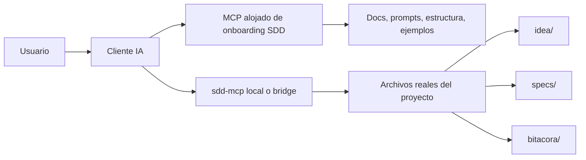
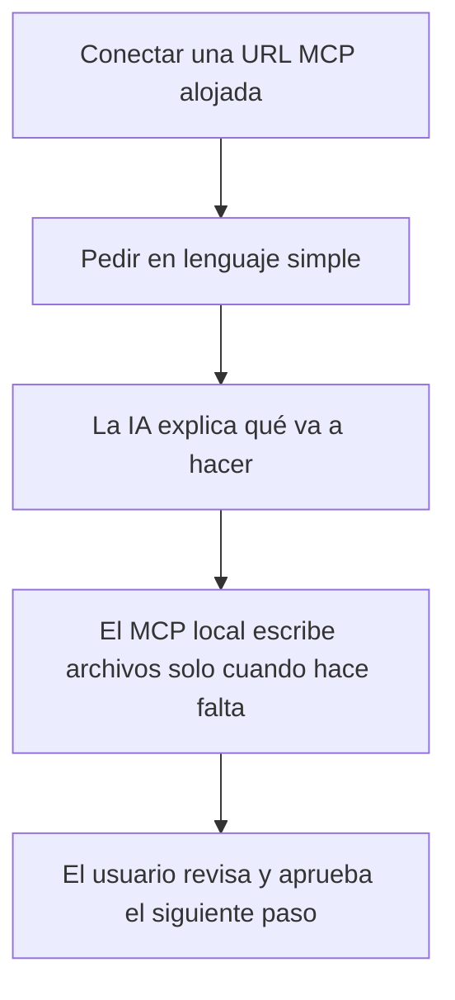

# Modelo de onboarding MCP alojado

## Propósito

Esta guía explica el modelo de producto más fácil para este framework:
- un MCP alojado para onboarding, docs, prompts y ayuda visual
- un MCP local o bridge local para escribir archivos reales en el proyecto del usuario

Usa esta página cuando necesites explicar cómo el framework puede volverse más fácil sin perder rigor.

## Separación del producto



## Por qué este modelo es el correcto

Problema:
- un MCP totalmente local da acceso real a archivos, pero sigue sintiéndose técnico de configurar
- un MCP totalmente alojado es fácil de conectar, pero no puede escribir de forma segura por sí solo dentro del proyecto local del usuario

Solución:
- dejar el MCP alojado para la capa de enseñanza
- dejar el MCP local para la capa de ejecución

Esto da:
- onboarding más fácil
- escritura real en archivos del proyecto
- reglas consistentes entre distintos clientes IA

## Responsabilidades por capa

### MCP alojado de onboarding

Propósito:
- explicar el framework
- exponer prompts para principiantes
- exponer mapas visuales de carpetas
- explicar resultados de comandos
- guiar al usuario antes de cualquier escritura real en el proyecto

Capacidades recomendadas:
- prompts como `easy_start_project`, `easy_create_spec`, `easy_show_structure`
- resources estáticos como policy, quickstart, guía fácil MCP y bancos de prompts
- ejemplos para proyectos nuevos y existentes
- guía visual de “qué pasa después”

### MCP local o bridge local

Propósito:
- crear carpetas y archivos
- actualizar `specs/INDEX.md`
- escribir archivos de bitácora
- validar el estado del proyecto
- revisar la compuerta SDD antes de implementar

Capacidades recomendadas:
- los tools actuales de `sdd-mcp`
- un wrapper CLI o launcher desktop opcional para conexión local de un clic

## Experiencia objetivo para el usuario

Para un usuario no técnico, la experiencia debe sentirse así:



El usuario no debería necesitar entender:
- transportes
- esquemas
- builds de paquetes
- reglas de workspace en detalle

El usuario debería entender solo:
- qué acción está ocurriendo
- qué archivos se tocarán
- qué resultado aparecerá
- cuál es el siguiente paso

## Enfoque recomendado de hosting

Corto plazo:
- mantener `sdd-mcp` local para operaciones
- publicar docs que definan el contrato de la capa alojada
- usar el transporte HTTP actual como base conceptual

Mediano plazo:
- alojar un endpoint MCP de onboarding orientado a lectura
- exponer prompts, guías fáciles, mapas de carpetas y ejemplos
- mantener las escrituras en local

Largo plazo:
- ofrecer un launcher de un clic o un bridge local delgado que la capa alojada pueda orquestar a través del cliente

## Contrato mínimo alojado

El MCP alojado de onboarding debería ofrecer al menos:
- `sdd://docs/easy-mcp`
- `sdd://docs/quickstart`
- `sdd://policy/current`
- un catálogo de comandos fáciles
- prompts para inicio de proyecto, creación de spec, explicación de estructura, validación, siguiente paso y cierre de sesión

## Explicación copiar/pegar para usuarios

```text
Puedes usar SDD en dos partes simples.
Una parte te enseña y guía.
La otra parte escribe los archivos reales en tu proyecto.
Así el inicio es simple y la ejecución es segura.
```
