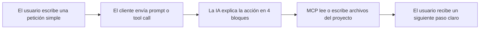
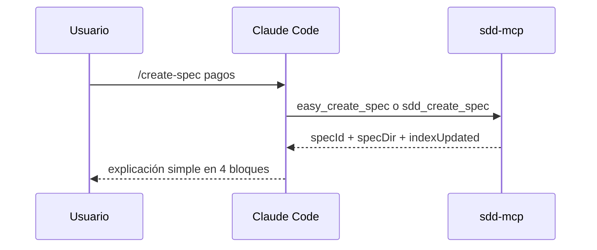
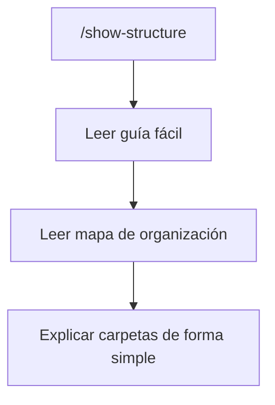

# Ejemplos visuales por cliente para MCP fácil

## Propósito

Esta guía muestra cómo debería verse el uso fácil de MCP en clientes reales.

No es una especificación de transporte. Es una referencia de experiencia de usuario.

## Modelo mental compartido



## Ejemplo estilo Claude Code

Mensaje del usuario:

```text
/create-spec pagos
```

Qué debería decir la IA:

```text
Qué voy a hacer:
- crear una nueva spec llamada pagos

Qué archivos voy a crear o actualizar:
- specs/002-pagos/spec.md
- specs/002-pagos/plan.md
- specs/002-pagos/tasks.md
- specs/002-pagos/research.md
- specs/002-pagos/history.md
- specs/002-pagos/contracts/README.md
- specs/INDEX.md

Qué vas a tener al final:
- un paquete completo de spec listo para revisión

Qué sigue:
- revisar la spec y confirmar el alcance antes de pasar a aprobación
```

Flujo visual:



## Ejemplo estilo Cursor

Mensaje del usuario:

```text
/show-structure
```

Qué debería hacer la IA:
- explicar `idea/`, `specs/`, `bitacora/` y `docs/`
- señalar el mapa actual de carpetas
- decir en qué carpeta ocurrirá la siguiente acción



## Ejemplo estilo Codex

Mensaje del usuario:

```text
/validate-project
```

Qué debería hacer la IA:
- ejecutar validación
- ejecutar chequeo de compuerta
- traducir resultados a lenguaje simple
- terminar con un solo siguiente paso

Forma esperada de salida:

```text
Qué revisé:
- estructura del proyecto
- compuerta de implementación

Qué está bien:
- existen las carpetas requeridas
- el bundle actual de spec está completo

Qué sigue bloqueando la implementación:
- la spec actual todavía no está aprobada

Qué sigue:
- revisar spec.md y completar la aprobación antes de programar
```

## Ejemplo de adaptación de proyecto existente

Mensaje del usuario:

```text
/start-project
Mi proyecto ya existe en /ruta/app.
Adáptalo sin romper comportamiento.
```

Comportamiento esperado de la IA:
- detectar que es adaptación, no proyecto nuevo
- preservar el código existente
- crear la base SDD alrededor del proyecto existente
- explicar qué carpetas nuevas se están agregando

## Tabla de alias amigables

| Entrada amigable | Ruta MCP esperada | Resultado visible para el usuario |
|---|---|---|
| `/start-project` | `easy_start_project` + flujo de workspace o init | base de proyecto creada o ruta de adaptación explicada |
| `/create-spec login` | `easy_create_spec` + `sdd_create_spec` | nuevo paquete de spec numerada |
| `/show-structure` | `easy_show_structure` | mapa de carpetas explicado simple |
| `/validate-project` | `easy_validate_project` + tools de validación | estado claro de validación y compuerta |
| `/show-next-step` | `easy_show_next_step` | un solo siguiente paso exacto |
| `/close-session` | `easy_close_session` | cierre limpio y guía de handoff |

## Regla para cualquier cliente

Sin importar el cliente, la respuesta debe ser fácil de escanear y siempre contener:
- qué está haciendo la IA
- qué archivos va a tocar
- qué obtiene el usuario al final
- qué sigue
