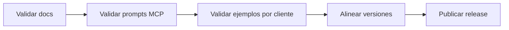

# Preparación v1.3.0

## Propósito

Esta página define la barra mínima para la release `v1.3.0`.

## Enfoque de la release

Adopción fácil de MCP.

## Flujo de release

## Alcance mínimo

- existe guía fácil MCP en inglés y español
- existe modelo de onboarding alojado en inglés y español
- existen ejemplos visuales por cliente en inglés y español
- MCP expone prompts fáciles y el resource de guía fácil
- el README muestra primero la ruta fácil antes de la ruta técnica profunda
- la CI y los smoke tests siguen en verde

## Checklist de release

- confirmar que el changelog incluye la capa easy MCP
- confirmar que los números de versión siguen alineados
- confirmar que los smoke tests MCP listan los nuevos prompts
- confirmar que todas las guías nuevas tienen su par bilingüe
- confirmar que todas las guías nuevas renderizan diagramas mermaid correctamente
