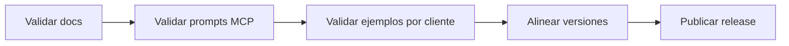

# Preparación v1.3.0

<!-- sdd:doc-type:start -->

<strong>Proyecto</strong> Material del repositorio: roadmap, lanzamientos y auditorías. No es documentación de producto.

<!-- sdd:doc-type:end -->

## Propósito

**Registro histórico. No es la lista a seguir.**

Esta era la barra mínima para la versión `v1.3.0`, que salió hace mucho: el
proyecto va por 2.5.0. Se conserva para poder consultar con qué criterio se
publicó aquella versión.

La lista viva, la que se sigue antes de publicar cualquier versión, es la
[guía 09](./09-release-checklist.md).

## Enfoque de la release

Adopción fácil de MCP.

## Flujo de release

```mermaid
flowchart LR
  A["Validar docs"] --> B["Validar prompts MCP"]
  B --> C["Validar ejemplos por cliente"]
  C --> D["Alinear versiones"]
  D --> E["Publicar release"]
```

## Alcance mínimo

- existe guía fácil MCP en inglés y español
- existe modelo de onboarding alojado en inglés y español
- existen ejemplos visuales por cliente en inglés y español
- MCP expone prompts fáciles y el resource de guía fácil
- el README muestra primero la ruta fácil antes de la ruta técnica profunda
- la CI y los smoke tests siguen en verde

## Checklist de release

- confirmar que el changelog incluye la capa easy MCP
- confirmar que los números de versión siguen alineados
- confirmar que los smoke tests MCP listan los nuevos prompts
- confirmar que todas las guías nuevas tienen su par bilingüe
- confirmar que todas las guías nuevas renderizan diagramas mermaid correctamente
