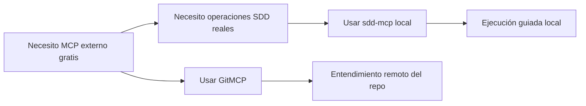

# Opciones gratuitas de MCP externo

## Propósito

Esta guía explica las opciones gratuitas de MCP externo que pueden ayudar a los usuarios a entender este framework de forma más fácil.

Se enfoca en una distinción clave:
- MCP externo gratuito de contexto de repositorio
- `sdd-mcp` local y operativo

## Respuesta rápida

Si hoy quieres un MCP externo gratis, la opción más simple es:
- `GitMCP`

Úsalo para:
- entendimiento del repositorio público
- descubrimiento de documentación
- difusión y demos

No lo uses como reemplazo de:
- operaciones SDD locales
- escritura de archivos del proyecto
- el comportamiento propio del framework

## Mapa de comparación



## Opción 1: GitMCP

Qué es:
- un MCP gratuito de contexto de repositorio para repos públicos de GitHub

Para qué sí sirve:
- permitir que la IA lea y entienda este repositorio de forma remota
- ayudar a la IA a entender docs y templates públicos
- darte una historia rápida de MCP externo para adopción

Para qué no sirve:
- escribir archivos dentro del proyecto local del usuario
- reemplazar `sdd-mcp`
- exponer tus contratos de tools propios como producto alojado

Para este repositorio, la idea es:
- repo GitHub: `https://github.com/juanklagos/spec-driven-development-template`
- versión GitMCP: `https://gitmcp.io/juanklagos/spec-driven-development-template`

## Opción 2: tu propio MCP alojado de onboarding

Qué es:
- un futuro MCP externo controlado por ti
- enfocado en prompts, docs, estructura y onboarding

Para qué sí sirve:
- tu propia superficie de producto
- tus propios prompts y resources
- una experiencia de onboarding con tu marca

Qué no debería reemplazar:
- las escrituras operativas locales en el proyecto del usuario

## Uso recomendado según audiencia

### Para descubrimiento público
- usa `GitMCP`

### Para onboarding del framework
- usa la documentación de este repo + `GitMCP`

### Para trabajo real sobre un proyecto
- usa `sdd-mcp` local

### Para madurez futura del producto
- combina `GitMCP` o similar con tu propio MCP alojado de onboarding y `sdd-mcp` local

## Explicación amigable para usuarios

```text
Si solo necesitas que la IA entienda mejor este repositorio público, un MCP externo gratis como GitMCP es suficiente.
Si necesitas que la IA guíe el flujo real de SDD y trabaje con archivos del proyecto, todavía necesitas el comportamiento propio del MCP del framework.
```

## Siguiente guía

Si quieres el flujo exacto paso a paso para conectar este repositorio, sigue con [Cómo conectar este repositorio con GitMCP](./48-como-conectar-este-repo-con-gitmcp.md).
