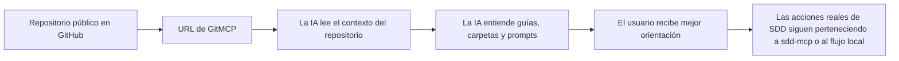
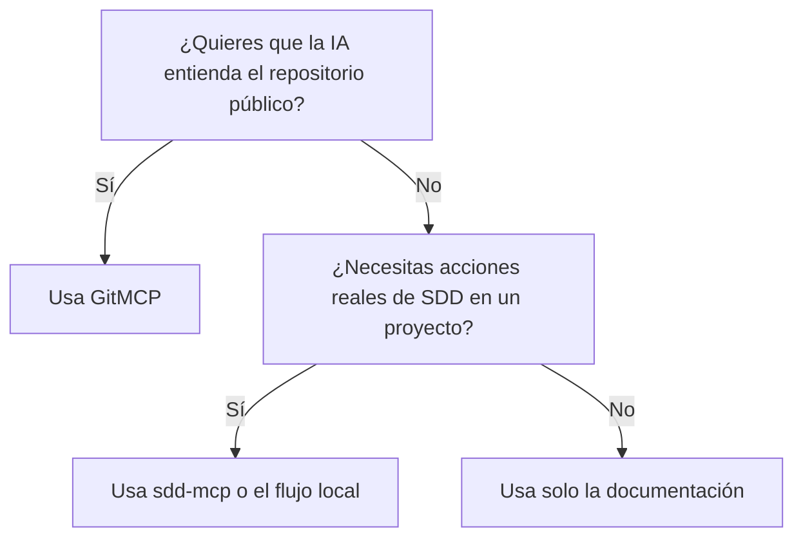

# Cómo conectar este repositorio con GitMCP

## Propósito

Esta guía explica, en lenguaje muy simple, cómo usar `GitMCP` con este repositorio.

Usa esta guía cuando:
- quieres una opción externa gratuita de MCP
- quieres que la IA entienda mejor este repositorio público
- no quieres empezar por una instalación local de MCP
- quieres una ruta copiar/pegar fácil de explicar a otra persona

## La idea simple

Piénsalo así:

- GitHub es la biblioteca
- GitMCP es el lector que ayuda a la IA a abrir la biblioteca
- `sdd-mcp` es el asistente de trabajo que ayuda a ejecutar el flujo real de SDD

Entonces:
- usa `GitHub` para compartir el repositorio con personas
- usa `GitMCP` para que una IA lea el repositorio público como contexto MCP
- usa `sdd-mcp` cuando necesites el flujo guiado real del framework

## Las dos URLs que necesitas

Repositorio principal:
- `https://github.com/juanklagos/spec-driven-development-template`

Versión GitMCP del mismo repositorio:
- `https://gitmcp.io/juanklagos/spec-driven-development-template`

## Qué pasa cuando usas GitMCP



## Para qué sí sirve GitMCP

GitMCP es útil para:
- leer el README
- leer la documentación
- entender la estructura de carpetas
- entender el contexto del framework SDD
- entender prompts, guías y templates
- ayudar a una IA a responder preguntas sobre este repositorio público

## Para qué no sirve GitMCP

GitMCP no es el motor operativo de este framework.

No deberías esperar que:
- cree specs locales dentro del proyecto del usuario por sí solo
- actualice archivos locales de `bitacora/` por sí solo
- reemplace el servidor local `sdd-mcp`
- actúe como la capa completa de ejecución del proyecto del usuario

## La explicación más corta posible

Si necesitas una sola frase, usa esta:

```text
GitMCP ayuda a la IA a entender este repositorio público; sdd-mcp ayuda a la IA a operar el flujo real de SDD.
```

## Paso a paso

### Paso 1: confirma la URL del repositorio

Para este proyecto, el repositorio público es:
- `https://github.com/juanklagos/spec-driven-development-template`

### Paso 2: deriva la URL de GitMCP

Toma la ruta de GitHub:
- `github.com/juanklagos/spec-driven-development-template`

Reemplaza `github.com` por `gitmcp.io`:
- `gitmcp.io/juanklagos/spec-driven-development-template`

URL final:
- `https://gitmcp.io/juanklagos/spec-driven-development-template`

### Paso 3: agrega esa URL en un cliente que soporte MCP remoto

Si tu cliente de IA soporta servidores MCP remotos por URL, usa:

```text
https://gitmcp.io/juanklagos/spec-driven-development-template
```

Modelo mental simple:
- si el cliente acepta una URL MCP, pega la URL de GitMCP
- si el cliente solo soporta MCP local, GitMCP puede no ser la mejor primera opción allí

### Paso 4: dile a la IA para qué sirve esa conexión

Usa una instrucción corta como esta:

```text
Usa GitMCP para este repositorio para entender la documentación del framework, la estructura de carpetas, los prompts y las guías de onboarding.
Si necesitamos acciones reales de SDD para un proyecto, usa correctamente el flujo del framework y explícame qué va a pasar paso a paso.
```

### Paso 5: revisa si la IA lo está usando bien

Un buen resultado se ve así:
- la IA explica mejor el framework
- la IA nombra las guías correctas
- la IA entiende la estructura de carpetas
- la IA no confunde GitMCP con `sdd-mcp`

Un mal resultado se ve así:
- la IA dice que GitMCP va a crear archivos locales en tu proyecto automáticamente
- la IA dice que GitMCP reemplaza todo el flujo del framework
- la IA ignora la diferencia entre contexto del repo público y ejecución real del proyecto

## Prompts para copiar y pegar

### Prompt para usuario no técnico

```text
Usa la conexión GitMCP para https://github.com/juanklagos/spec-driven-development-template para que entiendas mejor este framework.
Guíame con lenguaje simple.
Explícame qué hace cada paso y qué debo esperar después.
Si necesitamos acciones reales de SDD en un proyecto, usa el flujo correcto y avísame antes de cambiar archivos.
```

### Prompt para operador o usuario técnico

```text
Usa GitMCP para el contexto del repositorio.
Lee primero la guía fácil MCP, el mapa de organización del proyecto y el modelo de onboarding.
No confundas GitMCP con la capa operativa sdd-mcp del framework.
Sé explícito sobre qué parte es contexto del repositorio y qué parte es ejecución real del flujo.
```

## Regla de decisión fácil

Usa esta regla:

- si necesitas que la IA entienda el repositorio público: usa `GitMCP`
- si necesitas que la IA ayude con el flujo real de SDD en un proyecto: usa `sdd-mcp` o el flujo local del framework
- si necesitas ambas cosas: usa `GitMCP` para contexto y `sdd-mcp` para operaciones



## Qué debería esperar el usuario

Si GitMCP se usa correctamente, el usuario debería esperar:
- explicaciones más claras
- mejor orientación de onboarding
- mejor entendimiento de la estructura del framework
- mejores referencias a las guías correctas

El usuario no debería esperar:
- ejecución automática del proyecto solo porque GitMCP esté conectado
- creación automática de specs locales solo porque el repositorio sea público
- que todo el flujo local ocurra sin la capa operativa

## Combinación recomendada para este repositorio

Mejor combinación:

1. `GitMCP`
Propósito:
- ayudar a la IA a entender este repositorio público del framework

2. `sdd-mcp` local
Propósito:
- ejecutar el flujo guiado real de SDD
- trabajar con los archivos reales del proyecto objetivo

3. documentación del proyecto
Propósito:
- mantener alineados a humanos e IA sobre qué sigue

## Guías relacionadas

- [Guía fácil de MCP](./43-guia-mcp-facil.md)
- [Modelo de onboarding MCP alojado](./44-modelo-onboarding-mcp-alojado.md)
- [Opciones gratis de MCP externo](./47-opciones-gratis-mcp-externo.md)
- [Mapa de organización del proyecto](./42-mapa-organizacion-proyecto.md)
