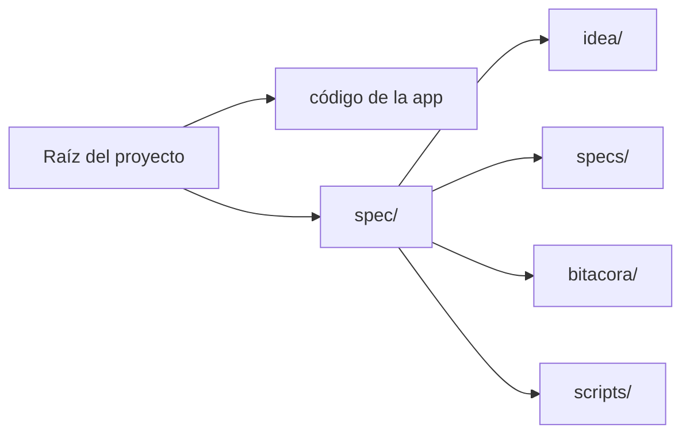
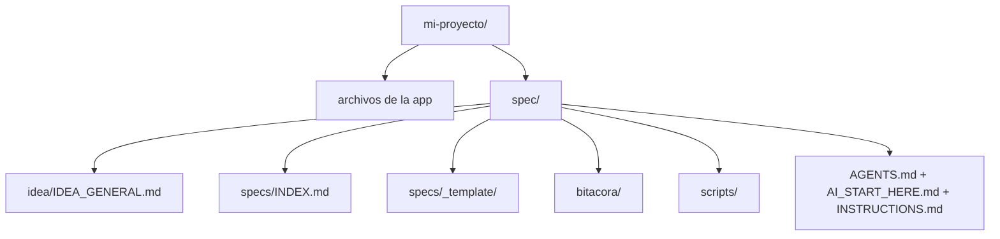

# Prompts para sidecar `spec/`

## Propósito

Usa estos prompts cuando quieres que una IA use este framework sin clonar ni copiar el repositorio completo dentro de tu proyecto.

La regla es simple:

- el código del proyecto vive en la raíz del proyecto
- los artefactos SDD viven en `./spec/`
- el framework completo solo se copia si tú pides explícitamente el modo standalone

## Modelo mental simple



## Prompt exacto para un proyecto nuevo

```text
Usa https://github.com/juanklagos/spec-driven-development-template como referencia principal para mi proyecto.

No clones ni copies el repositorio completo dentro de mi proyecto.
Crea solo el sidecar compacto `spec/` dentro del proyecto.
Mantén el código ejecutable del proyecto en la raíz del proyecto.

Si el proyecto es nuevo, crea primero una raíz limpia del proyecto y luego instala `spec/`.
Si hace falta, usa GitHub Spec Kit en la raíz del proyecto, pero mantén el sistema operativo SDD dentro de `./spec/`.

Luego guíame paso a paso:
1. define la idea
2. crea la primera spec
3. explícame qué archivos fueron creados
4. explícame cuál es el siguiente paso

No escribas código de implementación todavía.
No uses el modo full standalone a menos que yo lo pida explícitamente.
```

## Prompt exacto para un proyecto existente

```text
Usa https://github.com/juanklagos/spec-driven-development-template como referencia principal para este proyecto existente: [RUTA_DEL_PROYECTO].

No clones ni copies el repositorio completo dentro del proyecto.
Instala solo el sidecar compacto `spec/`.
Mantén el código actual del proyecto en la raíz del proyecto.

Adapta el proyecto a SDD creando:
- `spec/idea/`
- `spec/specs/`
- `spec/bitacora/`
- `spec/scripts/`

Crea la primera spec con base en el comportamiento actual del proyecto.
Explícame cada paso con lenguaje simple.
Dime qué archivos fueron creados o actualizados.

No escribas código de implementación todavía.
No uses el modo full standalone a menos que yo lo pida explícitamente.
```

## Prompt exacto para Codex, Claude, Cursor o similar

```text
Trabaja en modo sidecar.

Usa https://github.com/juanklagos/spec-driven-development-template como referencia del framework.
No clones ni copies el repositorio completo dentro de mi proyecto a menos que yo pida explícitamente el modo standalone.
Instala y usa solo el sidecar compacto `spec/` por defecto.

La raíz del proyecto es para el código de la app.
La carpeta `spec/` es para el sistema operativo SDD.

Antes de cambiar archivos, explícame:
1. qué vas a hacer
2. qué archivos vas a crear o actualizar
3. qué voy a tener al final
4. cuál es el siguiente paso

No implementes código hasta que la spec activa esté aprobada y el plan esté alineado.
```

## Qué debería crear la IA

Después de una instalación correcta del sidecar, el usuario debería esperar esta estructura:



## Qué no debería hacer la IA

La IA no debería:

- clonar el repositorio completo dentro de la raíz del proyecto
- copiar `docs/`, `packages/`, `www/` y todos los archivos del framework dentro de un proyecto avanzado
- mezclar archivos de mantenimiento del framework con el código del producto
- empezar implementación antes de que la primera spec esté clara

## El prompt más corto posible

```text
Usa este framework SDD en modo sidecar.
No copies el repositorio completo.
Instala solo `./spec/`, deja el código de la app en la raíz del proyecto, crea la primera spec y guíame paso a paso.
```

## Guías relacionadas

- [Mapa de organización del proyecto](./42-mapa-organizacion-proyecto.md)
- [Guía fácil de MCP](./43-guia-mcp-facil.md)
- [Cómo conectar este repositorio con GitMCP](./48-como-conectar-este-repo-con-gitmcp.md)
