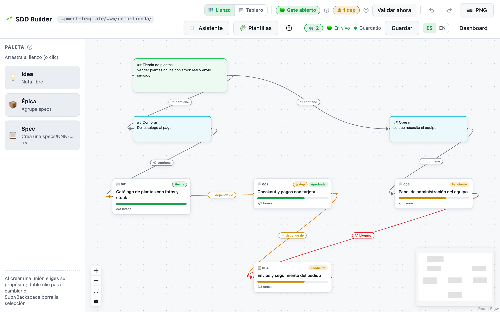
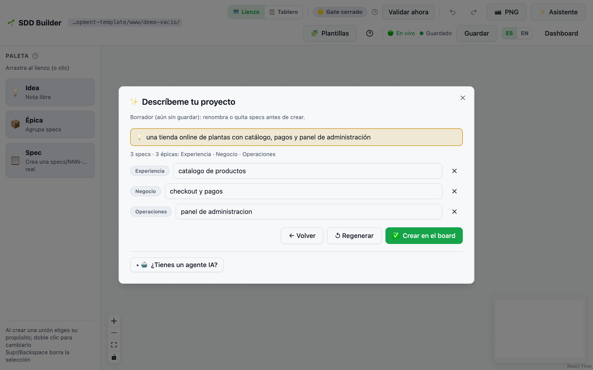
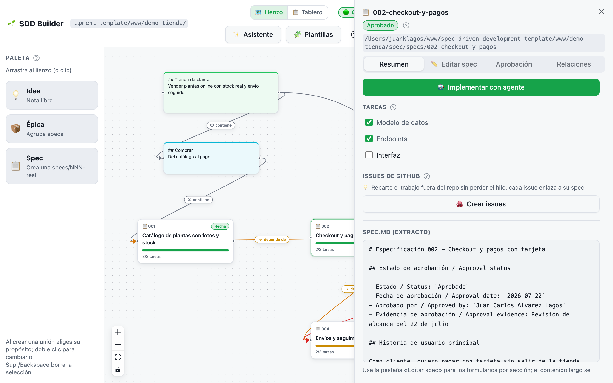
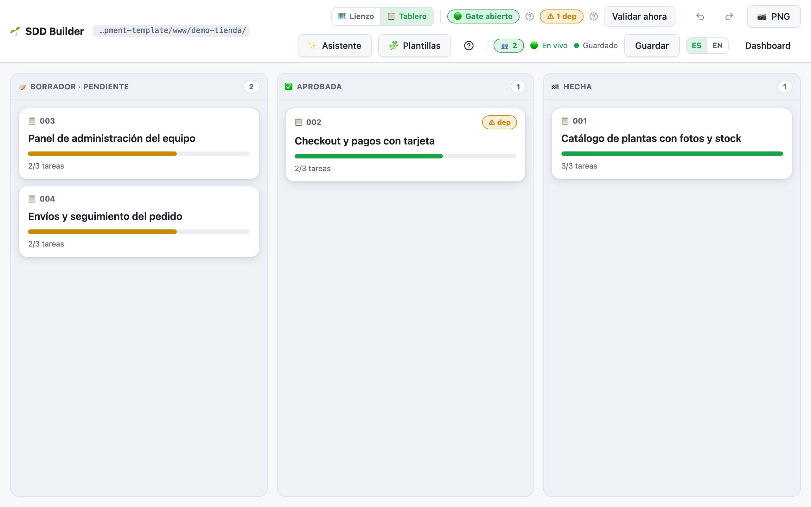
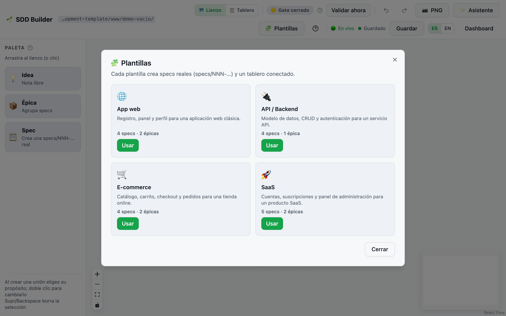

# 🎨 SDD Builder: construye tus specs visualmente

El SDD Builder es un lienzo drag-and-drop donde compones tu flujo SDD como tarjetas conectadas, y cada tarjeta es un bundle **real** `specs/NNN-slug/` en disco. Tu markdown sigue siendo la fuente de verdad: aprobar, editar y marcar tareas son operaciones que tocan solo lo justo dentro de tus archivos `.md`, mientras el lienzo no guarda más que posiciones y uniones en `specs/board.canvas` (el formato abierto JSON Canvas). Esta guía recorre el producto completo, desde el primer comando `npm` hasta usarlo desde un agente IA, con capturas reales de un proyecto demo pequeño: una tienda online de plantas.



*Un board, toda la verdad: gate abierto (🟢), un aviso ámbar `⚠ 1 dep`, uniones tipadas entre specs reales y el progreso de cada tarjeta leído en vivo de `tasks.md`.*

## Inicio rápido

```bash
# una sola vez: compila el frontend
npm run builder:build

# crea un workspace de juego (o usa cualquier proyecto con sidecar spec/)
./scripts/install-spec-sidecar.sh ~/sdd-playground --profile=recommended

# arranca el servidor apuntando a tu workspace
SDD_PROJECT_ROOT=~/sdd-playground npm run mcp:http:start
# abre http://127.0.0.1:3334/builder   (usa SDD_MCP_HTTP_PORT para cambiar el puerto)
```

Dos notas antes de empezar:

- Dentro de este repositorio template el builder está bloqueado a propósito (no se ejecuta trabajo de proyecto destino en la raíz del template). Apunta siempre `SDD_PROJECT_ROOT` a un workspace real.
- La primera vez que abras `/builder`, un **tour de bienvenida** ofrece cinco pasos anclados (paleta → crear → conectar → tareas → gate). Descártalo con «No mostrar de nuevo» y relánzalo cuando quieras desde el botón «?» de la barra superior.

## Aprender mientras construyes: la ayuda dentro del producto

Esta plantilla es tanto una escuela como una herramienta, así que no deberías tener que leer una guía antes de poder usar el builder. Cada concepto SDD que muestra la interfaz se puede explicar **donde aparece**, en tu idioma. Un solo idioma a la vez: el interruptor ES/EN cambia todo, la ayuda incluida.

- Hay un `?` junto al concepto: solo icono, junto a los títulos de sección y a las insignias de estado, no en cada elemento. Al pulsarlo, una tarjeta pequeña explica el concepto en dos o tres frases. Lo encuentras en el título de la **Paleta** (💡 Idea vs 📦 Épica vs 📋 Spec, y cuál de ellas escribe de verdad en disco), el **chip del gate** (la regla de oro), la insignia **`⚠ N dep`** (qué te está diciendo un aviso de dependencia), la **insignia de estado y la pestaña Aprobación** del panel de spec (qué significa «aprobada» y qué escribe aprobar en `spec.md`), **Tareas** (las casillas son líneas `- [ ]` de `tasks.md`), **Criterios EARS** (por qué cada criterio se traduce en un test) y **Relaciones** (contiene / depende de / bloquea / relacionada).
- **Cada ayuda enlaza a la guía completa.** Cada tarjeta termina en un enlace «Guía completa →» que abre la página correspondiente del sitio de documentación: esta guía (51) para el builder, la guía 12 para EARS y la guía 02 para el flujo y el gate. Los slugs viven una sola vez en `sdd-core` (`DOC_GUIDES`), así que un enlace no puede pudrirse en un 404: el test de integración falla si un slug cambia o si el espejo del builder no coincide.
- **La ayuda cambia con el estado del workspace.** Cuando el gate está en rojo, su `?` no solo define la regla: dice *esto es la regla de oro funcionando* y lista qué falta ahora mismo (errores de validación, specs sin aprobar) con la siguiente acción para cada punto, y el mismo bloque aparece en la banda del gate del `/dashboard`. Un lienzo vacío dice qué significa «sin specs» en SDD (todavía no hay contrato en disco; se empieza por la spec, no por el código) y enlaza a la guía del flujo. Una spec sin tareas explica que el plan aún no se ha bajado a tareas, y cómo arreglarlo.
- Aprobar una spec, elegir el propósito de una unión y crear issues de GitHub llevan una única línea 💡 que explica la consecuencia: la firma de aprobación es lo que abre el gate, «depende de» y «bloquea» son los propósitos que generan avisos, y los issues enlazan de vuelta a la spec mientras `tasks.md` sigue siendo la fuente de verdad.

Todo ese texto vive en los diccionarios i18n (`builder/src/i18n.ts` y los diccionarios del panel en `packages/sdd-mcp/src/dashboard.ts`), nunca escrito a mano en un componente; los conjuntos de claves ES y EN se comprueban en tiempo de compilación. La ayuda contextual es complementaria al **tour de bienvenida**: el tour es un recorrido de una vez, el `?` está siempre.

## Tu primer proyecto con el asistente ✨

La forma más rápida de pasar de nada a un board conectado es el botón **✨ Asistente** de la barra superior. Describe tu proyecto en una frase — *«una tienda online de plantas con catálogo, pagos y panel de administración»* — y el builder propone un borrador de board: una nota de idea, 2-4 épicas y 3-6 specs agrupadas por los dominios que detecta (auth, pagos, catálogo, admin, API, notificaciones, perfil, búsqueda; con un fallback MVP genérico cuando nada encaja).



*El borrador es una vista previa: renombra o quita specs, pulsa «↺ Regenerar» para nombres alternativos. Nada toca el disco hasta que confirmes.*

Lo importante es lo que el asistente **no** hace: nunca llama a un LLM (no hay API keys que configurar, solo heurísticas locales) y no escribe nada hasta que pulsas **«Crear en el board»**. En ese momento ejecuta las mismas llamadas reales que la galería de plantillas — un `POST /api/spec` por spec más el lienzo pre-ordenado — así que terminas con bundles `specs/NNN-slug/` auténticos, no maquetas. El asistente solo se aplica en un workspace vacío.

Si *sí* tienes un agente IA, la sección plegable «🤖 ¿Tienes un agente IA?» precarga un prompt orquestador copiable que delega el mismo trabajo a inteligencia real vía MCP — ver [Desde un agente IA](#desde-un-agente-ia-mcp) más abajo.

## El lienzo, día a día

Todo lo que hay en el lienzo corresponde a algo real:

- **Las tarjetas de spec** muestran el número y nombre del bundle, un badge de aprobación (Pendiente / Aprobado / Hecho) y una barra de progreso calculada con los checkboxes reales de `tasks.md`. Arrastra una tarjeta **Spec** desde la paleta y ponle nombre: se crea al momento un bundle real `specs/NNN-slug/` (spec, plan, tasks, history).
- **Las notas 💡 Idea y 📦 Épica** son nodos de texto libres, con color, para dar forma a la historia alrededor de tus specs. Viven solo en `board.canvas`.
- **Las uniones** se dibujan arrastrando entre tarjetas — y en el momento de crear una se abre un selector de propósito sobre la propia unión (spec 010): **contiene** (gris, épica → spec), **depende de** (ámbar), **bloquea** (rojo), **relacionada** (azul, por defecto) o cualquier etiqueta libre. Doble clic en la unión para cambiar su propósito después. El propósito viaja en el campo `label` de `board.canvas` (las grafías ES y EN son canónicas) más un `color` estándar de JSON Canvas.
- **Mover tarjetas** guarda posiciones (con debounce) en `board.canvas`, y nunca toca tus `.md`. El lienzo tiene deshacer/rehacer (Cmd/Ctrl+Z, Shift+Cmd/Ctrl+Z) y un botón «📷 PNG» para exportar el tablero como imagen.

Las uniones tipadas se ganan el sueldo con los **avisos de dependencias**: cuando una unión tipada conecta dos specs reales y la spec dependiente está aprobada pero su dependencia no, el builder avisa — un chip ámbar `⚠ N dep` junto al semáforo del gate (lista completa en el tooltip) y un badge ámbar `⚠ dep` en la tarjeta dependiente, en ambas vistas. Solo consultivo: el gate nunca se cierra por esto. En la captura de arriba, `002-checkout-y-pagos` está aprobada pero depende de `004-envios-y-seguimiento`, que sigue pendiente: no puedes cobrar el total sin saber el costo del envío. De ahí el aviso.

El **semáforo del gate** de la barra superior es el hard stop de SDD hecho visible: un chip vivo (🟢 abierto / 🔴 cerrado) más un botón «Validar ahora» que ejecuta la validación real del proyecto. Los errores del gate aparecen como badge rojo `⚠ N` con tooltip sobre la tarjeta afectada.

Al hacer clic en cualquier tarjeta de spec se abre el **panel (drawer)**, el puente entre lienzo y markdown:



*El panel de una spec aprobada: las tareas son los checkboxes reales de `tasks.md`, el botón «Implementar con agente» está habilitado porque la spec está aprobada, y las cuatro pestañas (Resumen, Editar spec, Aprobación, Relaciones) cubren el ciclo completo.*

En el panel, las tareas son checkboxes vivos: marcar uno cambia solo esa línea `- [ ]` de `tasks.md` a `- [x]`, y la barra de progreso de la tarjeta lo refleja. Debajo de las tareas tienes un extracto de `spec.md` en solo lectura — el contenido largo se edita en tu editor, por diseño: el lienzo compone, tu editor escribe.

La **sincronización en vivo** evita que las dos caras se desincronicen. El servidor vigila tu directorio `specs/`: edita cualquier `tasks.md` en tu editor y la tarjeta se actualiza sola, sin recargar. La barra superior muestra **🟢 En vivo**; si el servidor se reinicia con otro workspace, un banner ámbar te pide recargar. Regla de concurrencia: tu markdown siempre gana; el layout del lienzo es «último escritor gana».

## Editar y aprobar specs

La pestaña **«✏️ Editar spec»** del panel es un editor guiado completo (spec 010): un formulario por CADA sección del template, en un acordeón ordenado al que puedes añadir, quitar y reordenar: historia de usuario, escenarios de aceptación, criterios EARS, requisitos, propiedades de la spec, criterios de éxito y fuera de alcance. Los guardados son quirúrgicos. Solo se reescriben los headings que editaste; el bloque de aprobación nunca se toca. El campo EARS autocompleta el prefijo `CUANDO … EL SISTEMA DEBERÁ …` al enfocar, y un **lint EARS en vivo** marca cada criterio en verde (con forma EARS) o ámbar (sugerencia) con una pista corta: normalmente el esqueleto a seguir, o una palabra vaga sin número medible detrás (*rápido, fácil, intuitivo…*). Solo consultivo: nunca bloquea el guardado. La misma regla está exportada para agentes como `validateEarsCriterion` en `sdd-core`.

Cuando la spec está lista, la pestaña **«Aprobación»** muestra el bloque real como formulario: estado y fecha en solo lectura (aprobar estampa `Aprobado` + la fecha de hoy), aprobador y evidencia editables. Lo escribe en `spec.md` sin tocar el resto del archivo. Si la spec no tiene bloque de aprobación, recibes un error claro en lugar de un arreglo silencioso. La pestaña **«Relaciones»** lista cada unión con propósito que toca la spec (entrantes/salientes) con su icono y color, y permite cambiar el propósito o eliminar la unión.

La aprobación desbloquea **«🤖 Implementar con agente»**: un modal precarga el prompt exacto de arranque de implementación (ruta del workspace, carpeta de la spec, ejecutar la compuerta SDD, registrar consentimiento, hard stop, marcar tareas, cerrar con el contrato de sesión) detrás de un botón «Copiar prompt». Copy-first por diseño: sin deep links frágiles; funciona con Claude Code, Codex, Cursor, lo que sea. En una spec no aprobada el botón está deshabilitado con el hard stop explícito: *no hay código sin spec aprobada y plan consistente*.

## La vista de equipo

El toggle **«🗺️ Lienzo ↔ 📋 Tablero»** de la barra superior muestra las mismas specs como un kanban — tres columnas según el estado real de tus `.md`: **Borrador · Pendiente**, **Aprobada** (la línea `Estado / Status` del `spec.md`) y **Hecha** (todas las tareas marcadas). Las tarjetas conservan su barra de progreso y abren el mismo panel.



*Los mismos datos, otra proyección: las columnas salen de `spec.md` y `tasks.md`, no de un estado aparte del tablero.*

v1 honesta: arrastrar una tarjeta a otra columna *no cambia nada* en disco: aprobar es un acto real sobre la spec, así que al soltar aparece un toast («La aprobación se hace en la spec») con un botón «Abrir spec» directo al flujo de aprobación del panel.

Aquí viven dos funciones de equipo más:

- **Tareas → issues de GitHub**: en el panel, «🐙 Crear issues» crea un issue de GitHub por cada tarea **pendiente** vía tu `gh` CLI local — título `[<specId>] <tarea>` para trazabilidad, cuerpo con enlace al `tasks.md` del bundle. Idempotente por título: las tareas cuyo título exacto ya existe se saltan, y el resultado se informa por tarea (creada / saltada / fallida) con enlaces. Degrada con honestidad: sin repo git, sin remote o sin `gh` autenticado recibes un error bilingüe claro que te dice exactamente qué ejecutar.
- **Presencia**: cuando más de una persona (o agente) tiene el builder abierto sobre el mismo workspace, la barra superior muestra **👥 N** («N personas viendo este workspace») — con el mismo hub SSE de la sincronización en vivo, incluidas entradas y salidas.

## Plantillas

Si prefieres partir de una forma probada en lugar de una frase, el botón **🧩 Plantillas** abre una galería con cuatro playbooks: App web, API/Backend, E-commerce y SaaS. Cada uno crea specs reales más un tablero conectado y ordenado. Como el asistente, las plantillas solo se aplican en un workspace con cero specs.



*Cada tarjeta de plantilla te dice exactamente qué va a crear: bundles reales `specs/NNN-…` y un tablero conectado, sin placeholders.*

## Desde un agente IA (MCP)

Cualquier cliente MCP conectado a `sdd-mcp` puede trabajar con el mismo board. Las tools del board — `sdd_board_read`, `sdd_board_write`, `sdd_board_connect`, `sdd_read_tasks`, `sdd_set_task_done` — están respaldadas por la misma capa `sdd-core` que el lienzo, así que lo que tu agente escribe es lo que ves en `/builder` (y viceversa). Los agentes también tienen los poderes del panel (`sdd_gate_summary`, `sdd_approve_spec`, `sdd_update_spec_sections`, `sdd_create_spec`), y los avisos de dependencias aparecen en el campo `dependencyWarnings` de `sdd_gate_summary` y de `GET /api/gate`. Ver guía 41 (referencia completa de MCP).

### Conecta tu agente

El comando exacto por cliente — ejecútalo desde (o apuntando a) el proyecto en el que quieres que trabaje el agente. Todo lo que el agente escribe aparece **en vivo** en `/builder` (el watcher SSE recoge cada cambio en disco), y todo lo que haces en el builder lo ve el agente al instante.

**Claude Code** (un comando, desde el directorio de tu proyecto):

```bash
claude mcp add sdd --env SDD_PROJECT_ROOT=$(pwd) -- npx -y @juanklagos/sdd-mcp
```

**Codex** (añade a `~/.codex/config.toml`):

```toml
[mcp_servers.sdd]
command = "npx"
args = ["-y", "@juanklagos/sdd-mcp"]
env = { SDD_PROJECT_ROOT = "/ruta/absoluta/a/tu/proyecto" }
```

**Gemini CLI** (añade a `~/.gemini/settings.json`, o al `.gemini/settings.json` del proyecto):

```json
{
  "mcpServers": {
    "sdd": {
      "command": "npx",
      "args": ["-y", "@juanklagos/sdd-mcp"],
      "env": { "SDD_PROJECT_ROOT": "/ruta/absoluta/a/tu/proyecto" }
    }
  }
}
```

**Claude Desktop / ChatGPT (conector HTTP)**: arranca el servidor HTTP y apunta un conector personalizado al endpoint Streamable HTTP:

```bash
SDD_PROJECT_ROOT=/ruta/absoluta/a/tu/proyecto npm run mcp:http:start
# URL del conector: http://127.0.0.1:3334/mcp   (SDD_MCP_HTTP_PORT cambia el puerto)
```

En clientes con soporte de MCP Apps, pedir el board renderiza la vista embebida dentro del chat (la tool `sdd_board_app` — ver la sección MCP App más abajo).

### El prompt orquestador (IA real vía MCP)

La sección «¿Tienes un agente IA?» del asistente ofrece este prompt (cópialo también desde aquí). Pégalo en cualquier agente conectado a `sdd-mcp` y construirá el board con inteligencia real, incluidas las secciones borrador dentro de cada spec:

```text
Eres mi agente SDD conectado al MCP `sdd-mcp`. Mi proyecto: "<describe tu proyecto>".
Objetivo: puebla el SDD Builder board como el asistente ✨, pero con inteligencia real.
1. Lee el estado actual con `sdd_board_read` (projectRoot: <ruta del workspace>).
2. Propón 2-4 épicas y 3-6 specs con nombres claros, en minúsculas y sin acentos; enséñame la propuesta y espera mi OK antes de escribir nada.
3. Con mi OK: crea cada spec real con `sdd_create_spec`; rellena su borrador con `sdd_update_spec_sections` (historia de usuario, escenarios, criterios EARS «CUANDO … EL SISTEMA DEBERÁ …», fuera de alcance); dibuja el board con `sdd_board_write` + `sdd_board_connect` (nota de idea → épicas → specs, edges etiquetados).
4. No implementes código: el gate SDD sigue cerrado hasta que yo apruebe las specs.
```

### El board dentro de tu cliente IA (MCP App)

El servidor también entrega el board como **MCP App** (SEP-1865, la primera extensión oficial de MCP — parte de la release del protocolo 2026-07-28, construida con el SDK oficial `@modelcontextprotocol/ext-apps`). En un cliente con soporte de MCP Apps, pide a tu agente que muestre el board — invoca la tool `sdd_board_app` y la vista se renderiza **dentro del chat**: tarjetas de specs con estado de aprobación y progreso de tareas, el lienzo con sus uniones tipadas, el semáforo del gate y los avisos de dependencias, más un botón «↻ Actualizar / Refresh» que relee el workspace. Solo lectura en v1, bilingüe, con modo claro/oscuro.

Dónde está de verdad el estándar: la spec MCP 2026-07-28 es una release candidate congelada desde el 2026-05-21 con publicación final el 2026-07-28; la extensión Apps tiene una revisión estable (2026-01-26) y un SDK publicado, así que esta vista está construida sobre la superficie estable. En la práctica:

- Funciona en hosts que implementan MCP Apps; el soporte se está desplegando en los clientes durante la ventana de finalización.
- Los hosts **sin** MCP Apps no se rompen: `sdd_board_app` devuelve los mismos datos de board + gate como texto JSON.
- La vista es totalmente autocontenida (sin CDNs): el bridge oficial de ext-apps va inline dentro del recurso `ui://sdd/board.html`.
- A revisar tras el 2026-07-28: confirmar que el texto final de la spec mantiene `_meta.ui.resourceUri` + `text/html;profile=mcp-app` tal cual y subir `@modelcontextprotocol/ext-apps` si sale una versión final.

## Limitaciones (honestas)

- El contenido largo de `spec.md` más allá de las secciones guiadas se edita en tu editor, no en el lienzo.
- Borrar una carpeta de spec en disco no retira su tarjeta automáticamente (conservador; borra la tarjeta a mano).
- Un workspace por instancia del servidor (`SDD_PROJECT_ROOT`).
- La kanban es una proyección de solo lectura del estado: mover tarjetas entre columnas nunca aprueba ni desaprueba nada (usa el panel). La idempotencia de issues es por título (renombrar una tarea crea un issue nuevo).
- La demo interactiva en el sitio web sigue pendiente (requiere la FS Access API solo-Chrome); ver `specs/006-visual-spec-builder/`.

## Referencia rápida: lienzo → disco

| En el lienzo | Qué pasa en disco |
| :--- | :--- |
| Arrastra una tarjeta **Spec** de la paleta y ponle nombre | Se crea un bundle real `specs/NNN-slug/` (spec, plan, tasks, history) |
| Clic en una tarjeta de spec | Panel con sus tareas como checkboxes; extracto de spec.md en solo lectura |
| Marca un checkbox de tarea | La línea `- [ ]` de `tasks.md` pasa a `- [x]` quirúrgicamente |
| Conecta dos tarjetas, doble clic en la línea | Dependencia etiquetada (y opcionalmente tipada) guardada en `board.canvas` |
| Añade tarjetas 💡 Idea / 📦 Épica | Notas libres (con color) en `board.canvas` |
| Mueve tarjetas | Posiciones guardadas (con debounce) — nunca toca tus .md |
| Aprueba desde el panel | El bloque de aprobación real (estado, fecha, aprobador, evidencia) escrito en `spec.md` |
| Guarda en la pestaña Editar del panel | Solo se reescriben las secciones guiadas de `spec.md` — aprobación y requisitos intactos |
