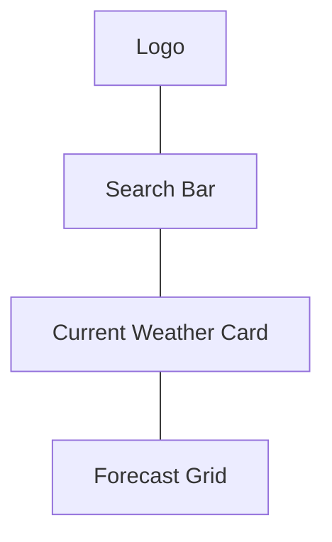

# 📝 Spec: UI Shell & Searching

## 🆔 Identifier: `001-ui-shell`
## 🎭 Actors
- **User:** Wants to find weather by city.
- **Search System:** Handles input and triggers data fetch.

## 📖 Description
The shell provides the main layout: Search bar at top, Hero section for current weather, and Grid for forecast.

## 🛠️ Requirements
1. **Search Bar:** Centered input with "Search" button.
2. **Input Validation:** Min 2 characters, alphanumeric.
3. **Empty State:** Show "Search for a city to begin".
4. **Loading State:** Spinning icon while fetching.

## 🎨 User Interface (Draft)

## 🧪 Acceptance Criteria
- [ ] Render search bar on landing.
- [ ] Display error message if city not found.
- [ ] Change background color based on "WeatherType" (Sunny, Rainy, etc).
