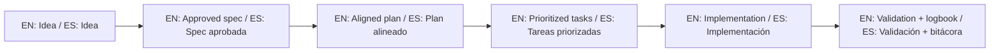

# 🎯 General Project Idea / Idea general del proyecto

> [!IMPORTANT]
> **EN:** This file is the foundation of your project. Before writing any code or detailed specs, define the "What" and "Why" here.
> **ES:** Este archivo es la base de tu proyecto. Antes de escribir código o especificaciones detalladas, define el "¿Qué?" y el "¿Por qué?" aquí.

---

## 💎 Project Name / Nombre del proyecto
<!-- EN: Name of the application or service. -->
<!-- ES: Nombre de la aplicación o servicio. -->

Spec-Driven Development Template (SDD Template)

## 🧩 Problem to solve / Problema que se quiere resolver
<!-- EN: Describe the current pain point or gap you are addressing. -->
<!-- ES: Describe el problema actual o la brecha que intentas resolver. -->

Developers and teams lose critical decisions in chat threads, start coding without clear requirements, suffer painful onboarding when new members join, and struggle to maintain traceability between ideas and implementation. AI assistants compound this by generating code without structured context, leading to hallucinations and scope creep.

Los desarrolladores y equipos pierden decisiones críticas en hilos de chat, empiezan a codificar sin requisitos claros, sufren onboarding doloroso cuando se unen nuevos miembros, y luchan por mantener trazabilidad entre ideas e implementación. Los asistentes de IA agravan esto al generar código sin contexto estructurado, provocando alucinaciones y scope creep.

## 🚀 Main Goal / Objetivo principal
<!-- EN: What is the single most important outcome of this project? -->
<!-- ES: ¿Cuál es el resultado más importante que busca este proyecto? -->

Provide a ready-to-use, zero-configuration template that any developer (from beginner to advanced) can adopt in under 30 minutes to bring specification-first discipline to their projects — with or without AI assistance.

Proveer un template listo para usar, sin configuración, que cualquier desarrollador (de principiante a avanzado) pueda adoptar en menos de 30 minutos para aplicar disciplina specification-first en sus proyectos — con o sin asistencia de IA.

## 📏 Initial Scope / Alcance inicial (MVP)
<!-- EN: List the core features for the first version. -->
<!-- ES: Lista las características principales para la primera versión. -->
- Standardized folder structure: `idea/`, `specs/`, `bitacora/`
- Blank templates for specs, plans, tasks, history, research, and contracts
- Validation script (`validate-sdd.sh`) to enforce structural compliance
- Spec generation script (`new-spec.sh`) for fast bootstrapping
- Init script (`init-project.sh`) to set up new projects from the template
- Bilingual documentation (EN/ES) covering all aspects of SDD
- At least one Golden Example demonstrating the full SDD lifecycle
- Multi-agent AI support files (Cursor, Claude, Gemini, Copilot)
- GitHub Actions CI to validate template integrity on every push

## 🚫 Out of Scope / Fuera de alcance
<!-- EN: What will NOT be built in this phase? (Crucial for avoiding scope creep). -->
<!-- ES: ¿Qué NO se construirá en esta fase? (Crucial para evitar que el alcance crezca sin control). -->
- Code generation or scaffolding for specific tech stacks
- GUI or web interface for managing specs
- SaaS version or hosted platform
- Automated AI-driven spec writing (beyond prompts)
- Integration with project management tools (Jira, Linear, etc.)

## 👤 Target Users / Usuarios objetivo
<!-- EN: Who are you building this for? -->
<!-- ES: ¿Para quién estás construyendo esto? -->

1. **Solo developers** using AI tools (ChatGPT, Claude, Copilot, Cursor) who want structured project execution
2. **Small teams** (2–5 people) looking for lightweight process without heavy tooling
3. **Non-programmers** who want to define ideas clearly before handing off to developers or AI
4. **Legacy project owners** who need to retrofit structure and traceability into existing codebases

## ⚠️ Main Risks & Assumptions / Riesgos y Supuestos principales
<!-- EN: Technical or business hurdles you expect to face. -->
<!-- ES: Obstáculos técnicos o de negocio que esperas encontrar. -->
- Risk: Users may perceive 30+ docs as overwhelming → Mitigated by QUICKSTART.md and progressive disclosure
- Risk: Users may not understand the value without seeing it in practice → Mitigated by Golden Example
- Assumption: Markdown-only approach is sufficient for most users
- Assumption: Bilingual (EN/ES) covers the primary target audience

## 📈 Success Metrics / Métricas de éxito
<!-- EN: How will you know the project is successful? (e.g., users, performance, specific behavior). -->
<!-- ES: ¿Cómo sabrás si el proyecto es exitoso? (ej. usuarios, rendimiento, comportamiento específico). -->

- A new user can complete QUICKSTART.md and have a validated SDD structure in < 30 minutes
- `validate-sdd.sh --strict` passes with 0 errors on a fresh clone
- At least 1 complete Golden Example demonstrates the full idea → spec → implementation cycle
- All documentation is available in both EN and ES

## ✅ Global Completion Criteria / Criterio de terminado global
<!-- EN: What needs to happen to call this project "finished"? -->
<!-- ES: ¿Qué debe suceder para considerar este proyecto como "terminado"? -->

- All core folders and templates are present and validated
- QUICKSTART.md guides a user from zero to first spec in 5 steps
- All documentation files have substantive content (no stubs < 500 bytes)
- At least 1 narrated Golden Example exists
- CI passes on main branch
- Template itself follows SDD (dogfooding): this IDEA_GENERAL.md is filled, PROJECT_LOG.md has entries

---
*Created using the [Spec-Driven Development Template](https://github.com/juanklagos/spec-driven-development-template)*

## 🌐 Bilingual support / Soporte bilingüe

- EN: This repository is designed to be used in English and Spanish.
- ES: Este repositorio está diseñado para usarse en inglés y español.
- EN: Keep instructions simple, direct, and copy/paste-ready.
- ES: Mantén instrucciones simples, directas y listas para copiar/pegar.

## 🗣️ Prompt base / Base prompt

```text
EN: Using https://github.com/juanklagos/spec-driven-development-template, guide me step by step with SDD for my project.
My project is: [describe project in plain language].
Do not skip idea, spec, plan, tasks, logbook, and validation.

ES: Usando https://github.com/juanklagos/spec-driven-development-template, guíame paso a paso con SDD para mi proyecto.
Mi proyecto es: [explica el proyecto en lenguaje simple].
No omitas idea, spec, plan, tasks, bitácora y validación.
```

## 💡 Tips / Consejos

- EN: Ask the AI to confirm the active spec before coding.
- ES: Pide a la IA confirmar la spec activa antes de programar.
- EN: Keep one clear next step at the end of each session.
- ES: Deja un próximo paso claro al final de cada sesión.
- EN: Prefer simple language and concrete deliverables.
- ES: Prefiere lenguaje simple y entregables concretos.

## 📊 Visual flow / Flujo visual


