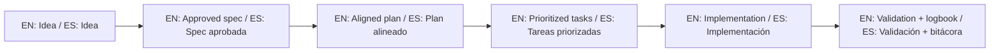

# Contributor License Agreement (CLA) / Acuerdo de Licencia de Contribuyente

## English

By submitting code, documentation, or other contributions to this repository, you represent and warrant that:

1. You have the legal right to submit the contribution.
2. Your contribution does not violate third-party rights.
3. You grant the repository owner a perpetual, worldwide, non-exclusive, royalty-free license to use, modify, distribute, sublicense, and relicense your contribution under this project's licensing model, including future commercial licensing by the owner.
4. You understand this project is not open source under OSI terms and is distributed under PolyForm Noncommercial 1.0.0 unless otherwise stated.

## Español

Al enviar código, documentación u otras contribuciones a este repositorio, usted declara y garantiza que:

1. Tiene el derecho legal para enviar la contribución.
2. Su contribución no infringe derechos de terceros.
3. Otorga al propietario del repositorio una licencia perpetua, mundial, no exclusiva y libre de regalías para usar, modificar, distribuir, sublicenciar y relicenciar su contribución bajo el modelo de licenciamiento del proyecto, incluyendo futuras licencias comerciales por parte del propietario.
4. Comprende que este proyecto no es open source bajo términos OSI y se distribuye bajo PolyForm Noncommercial 1.0.0 salvo indicación contraria.

## Contribution confirmation / Confirmación de contribución

Every pull request should include this line in the description:

`I agree to the CLA in CLA.md / Acepto el CLA de CLA.md`

## 🌐 Bilingual support / Soporte bilingüe

- EN: This repository is designed to be used in English and Spanish.
- ES: Este repositorio está diseñado para usarse en inglés y español.
- EN: Keep instructions simple, direct, and copy/paste-ready.
- ES: Mantén instrucciones simples, directas y listas para copiar/pegar.

## 🗣️ Prompt base / Base prompt

```text
EN: Using https://github.com/juanklagos/spec-driven-development-template, guide me step by step with SDD for my project.
My project is: [describe project in plain language].
Do not skip idea, spec, plan, tasks, logbook, and validation.

ES: Usando https://github.com/juanklagos/spec-driven-development-template, guíame paso a paso con SDD para mi proyecto.
Mi proyecto es: [explica el proyecto en lenguaje simple].
No omitas idea, spec, plan, tasks, bitácora y validación.
```

## 💡 Tips / Consejos

- EN: Ask the AI to confirm the active spec before coding.
- ES: Pide a la IA confirmar la spec activa antes de programar.
- EN: Keep one clear next step at the end of each session.
- ES: Deja un próximo paso claro al final de cada sesión.
- EN: Prefer simple language and concrete deliverables.
- ES: Prefiere lenguaje simple y entregables concretos.

## 📊 Visual flow / Flujo visual


