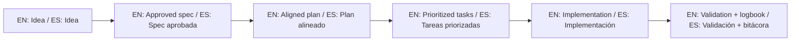

# Commercial License Policy / Política de Licencia Comercial

## English

This repository is distributed under PolyForm Noncommercial 1.0.0.
Commercial use is not allowed unless you receive explicit written authorization from the author.

Commercial use includes, but is not limited to:

- Selling this template or derivative works.
- Embedding it in paid products or paid consulting deliverables.
- Offering hosted services based on this code for revenue.
- Internal enterprise use tied to commercial operations.

To request a commercial license, contact:

- Owner: Juan Klagos
- Repository: https://github.com/juanklagos/spec-driven-development-template
- Contact channel: open an issue with title `Commercial License Request` and include company/legal details.

The author may grant or deny commercial licenses at sole discretion.

## Español

Este repositorio se distribuye bajo PolyForm Noncommercial 1.0.0.
El uso comercial no está permitido salvo autorización escrita explícita del autor.

Uso comercial incluye, entre otros casos:

- Venta de esta plantilla o derivados.
- Integración en productos pagos o entregables de consultoría pagos.
- Ofrecer servicios hospedados basados en este código para generar ingresos.
- Uso interno empresarial ligado a operaciones comerciales.

Para solicitar licencia comercial, contactar:

- Autor: Juan Klagos
- Repositorio: https://github.com/juanklagos/spec-driven-development-template
- Canal de contacto: abrir un issue con título `Commercial License Request` e incluir datos legales de la empresa.

El autor puede aprobar o rechazar licencias comerciales a su discreción.

## 🌐 Bilingual support / Soporte bilingüe

- EN: This repository is designed to be used in English and Spanish.
- ES: Este repositorio está diseñado para usarse en inglés y español.
- EN: Keep instructions simple, direct, and copy/paste-ready.
- ES: Mantén instrucciones simples, directas y listas para copiar/pegar.

## 🗣️ Prompt base / Base prompt

```text
EN: Using https://github.com/juanklagos/spec-driven-development-template, guide me step by step with SDD for my project.
My project is: [describe project in plain language].
Do not skip idea, spec, plan, tasks, logbook, and validation.

ES: Usando https://github.com/juanklagos/spec-driven-development-template, guíame paso a paso con SDD para mi proyecto.
Mi proyecto es: [explica el proyecto en lenguaje simple].
No omitas idea, spec, plan, tasks, bitácora y validación.
```

## 💡 Tips / Consejos

- EN: Ask the AI to confirm the active spec before coding.
- ES: Pide a la IA confirmar la spec activa antes de programar.
- EN: Keep one clear next step at the end of each session.
- ES: Deja un próximo paso claro al final de cada sesión.
- EN: Prefer simple language and concrete deliverables.
- ES: Prefiere lenguaje simple y entregables concretos.

## 📊 Visual flow / Flujo visual


