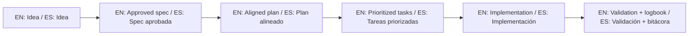

# Disclaimer and Limitation of Liability / Exención de Responsabilidad y Limitación

## English

This software and documentation are provided "AS IS", without warranties of any kind, express or implied, including merchantability, fitness for a particular purpose, and non-infringement.

To the maximum extent permitted by law, the author and contributors are not liable for any direct, indirect, incidental, special, exemplary, or consequential damages, including loss of profits, data, goodwill, business interruption, or security incidents arising from use or misuse.

You are solely responsible for:

- Validating outputs generated by AI assistants.
- Security, privacy, and legal compliance in your environment.
- Backup, disaster recovery, and deployment decisions.

## Español

Este software y su documentación se proporcionan "TAL CUAL", sin garantías de ningún tipo, expresas o implícitas, incluyendo comerciabilidad, idoneidad para un propósito particular y no infracción.

En la máxima medida permitida por ley, el autor y colaboradores no serán responsables por daños directos, indirectos, incidentales, especiales, ejemplares o consecuenciales, incluyendo pérdida de utilidades, datos, reputación, interrupción de negocio o incidentes de seguridad derivados del uso o mal uso.

Usted es el único responsable de:

- Validar resultados generados por asistentes de IA.
- Seguridad, privacidad y cumplimiento legal en su entorno.
- Respaldos, recuperación de desastres y decisiones de despliegue.

## Legal note / Nota legal

This file is an operational summary and does not replace the full license text in `LICENSE`.
Este archivo es un resumen operativo y no reemplaza el texto completo de la licencia en `LICENSE`.

## 🌐 Bilingual support / Soporte bilingüe

- EN: This repository is designed to be used in English and Spanish.
- ES: Este repositorio está diseñado para usarse en inglés y español.
- EN: Keep instructions simple, direct, and copy/paste-ready.
- ES: Mantén instrucciones simples, directas y listas para copiar/pegar.

## 🗣️ Prompt base / Base prompt

```text
EN: Using https://github.com/juanklagos/spec-driven-development-template, guide me step by step with SDD for my project.
My project is: [describe project in plain language].
Do not skip idea, spec, plan, tasks, logbook, and validation.

ES: Usando https://github.com/juanklagos/spec-driven-development-template, guíame paso a paso con SDD para mi proyecto.
Mi proyecto es: [explica el proyecto en lenguaje simple].
No omitas idea, spec, plan, tasks, bitácora y validación.
```

## 💡 Tips / Consejos

- EN: Ask the AI to confirm the active spec before coding.
- ES: Pide a la IA confirmar la spec activa antes de programar.
- EN: Keep one clear next step at the end of each session.
- ES: Deja un próximo paso claro al final de cada sesión.
- EN: Prefer simple language and concrete deliverables.
- ES: Prefiere lenguaje simple y entregables concretos.

## 📊 Visual flow / Flujo visual


