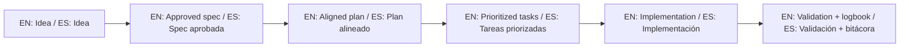

# Enforcement Policy / Política de Cumplimiento

## English

If you detect misuse (commercial use without authorization, removed notices, false attribution, or trademark abuse), report with evidence.

Recommended report content:

1. URL/repository or company details.
2. Description of suspected violation.
3. Evidence (screenshots, contracts, product pages, commit history).
4. Dates and impact assessment.

Report channel:

- Open an issue titled `License Violation Report`.

The author may apply one or more actions:

- Request voluntary compliance correction.
- Issue cease-and-desist notice.
- Submit platform takedown request.
- Escalate through legal counsel when required.

## Español

Si detecta uso indebido (uso comercial sin autorización, eliminación de avisos, falsa atribución o abuso de marca), repórtelo con evidencia.

Contenido recomendado del reporte:

1. URL/repositorio o datos de empresa.
2. Descripción de la posible violación.
3. Evidencia (capturas, contratos, páginas de producto, historial de commits).
4. Fechas y evaluación de impacto.

Canal de reporte:

- Abrir un issue con título `License Violation Report`.

El autor podrá aplicar una o más acciones:

- Solicitar corrección voluntaria de cumplimiento.
- Emitir requerimiento de cese de uso.
- Presentar solicitud de baja en plataformas.
- Escalar vía asesoría legal cuando sea necesario.

## 🌐 Bilingual support / Soporte bilingüe

- EN: This repository is designed to be used in English and Spanish.
- ES: Este repositorio está diseñado para usarse en inglés y español.
- EN: Keep instructions simple, direct, and copy/paste-ready.
- ES: Mantén instrucciones simples, directas y listas para copiar/pegar.

## 🗣️ Prompt base / Base prompt

```text
EN: Using https://github.com/juanklagos/spec-driven-development-template, guide me step by step with SDD for my project.
My project is: [describe project in plain language].
Do not skip idea, spec, plan, tasks, logbook, and validation.

ES: Usando https://github.com/juanklagos/spec-driven-development-template, guíame paso a paso con SDD para mi proyecto.
Mi proyecto es: [explica el proyecto en lenguaje simple].
No omitas idea, spec, plan, tasks, bitácora y validación.
```

## 💡 Tips / Consejos

- EN: Ask the AI to confirm the active spec before coding.
- ES: Pide a la IA confirmar la spec activa antes de programar.
- EN: Keep one clear next step at the end of each session.
- ES: Deja un próximo paso claro al final de cada sesión.
- EN: Prefer simple language and concrete deliverables.
- ES: Prefiere lenguaje simple y entregables concretos.

## 📊 Visual flow / Flujo visual


