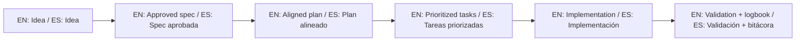

# Trademark Policy / Política de Marca

## English

"Spec-Driven Development Template" naming, branding references, and author attribution may not be used to imply endorsement, partnership, certification, or official support without prior written permission.

Not allowed without written permission:

- Using the project name/logo as your product brand.
- Stating or implying official partnership with the author.
- Using author identity for marketing claims.

Allowed:

- Factual attribution and citation.
- Linking to the original repository.
- Internal reference for educational noncommercial use.

## Español

El nombre "Spec-Driven Development Template", referencias de marca y atribución del autor no pueden usarse para implicar respaldo, alianza, certificación o soporte oficial sin permiso escrito previo.

No permitido sin permiso escrito:

- Usar el nombre/logo del proyecto como marca de su producto.
- Afirmar o insinuar alianza oficial con el autor.
- Usar identidad del autor para reclamos de marketing.

Permitido:

- Atribución factual y cita.
- Enlace al repositorio original.
- Referencia interna para uso educativo no comercial.

## 🌐 Bilingual support / Soporte bilingüe

- EN: This repository is designed to be used in English and Spanish.
- ES: Este repositorio está diseñado para usarse en inglés y español.
- EN: Keep instructions simple, direct, and copy/paste-ready.
- ES: Mantén instrucciones simples, directas y listas para copiar/pegar.

## 🗣️ Prompt base / Base prompt

```text
EN: Using https://github.com/juanklagos/spec-driven-development-template, guide me step by step with SDD for my project.
My project is: [describe project in plain language].
Do not skip idea, spec, plan, tasks, logbook, and validation.

ES: Usando https://github.com/juanklagos/spec-driven-development-template, guíame paso a paso con SDD para mi proyecto.
Mi proyecto es: [explica el proyecto en lenguaje simple].
No omitas idea, spec, plan, tasks, bitácora y validación.
```

## 💡 Tips / Consejos

- EN: Ask the AI to confirm the active spec before coding.
- ES: Pide a la IA confirmar la spec activa antes de programar.
- EN: Keep one clear next step at the end of each session.
- ES: Deja un próximo paso claro al final de cada sesión.
- EN: Prefer simple language and concrete deliverables.
- ES: Prefiere lenguaje simple y entregables concretos.

## 📊 Visual flow / Flujo visual


