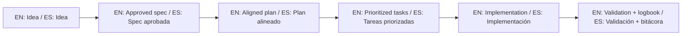

# Purpose and Positioning / Propósito y Posicionamiento

## Canonical statement / Declaración canónica

- EN: This repository is not an in-progress product; it is a starter template to quickly bootstrap SDD projects.
- ES: Este repositorio no representa un producto en desarrollo; representa un template para iniciar proyectos con SDD rápidamente.

## What it is / Qué es

- A reusable base to start new projects with Spec-Driven Development.
- A migration support base to adapt existing projects to SDD.
- A documentation-first structure to keep traceability and execution discipline.

## What it is not / Qué no es

- It is not the execution log of a single product.
- It is not a monolithic backlog for this repository itself.
- It is not a place to force fake active specs when no user project is being executed.

## Success criteria of this repository / Criterios de éxito de este repositorio

- New users can start with low friction in minutes.
- Any AI can guide without confusing template context with product context.
- Teams can produce consistent `idea/`, `specs/`, and `bitacora/` outputs in their own projects.

## 🌐 Bilingual support / Soporte bilingüe

- EN: This repository is designed to be used in English and Spanish.
- ES: Este repositorio está diseñado para usarse en inglés y español.
- EN: Keep instructions simple, direct, and copy/paste-ready.
- ES: Mantén instrucciones simples, directas y listas para copiar/pegar.

## 🗣️ Prompt base / Base prompt

```text
EN: Using https://github.com/juanklagos/spec-driven-development-template, guide me step by step with SDD for my project.
My project is: [describe project in plain language].
Do not skip idea, spec, plan, tasks, logbook, and validation.

ES: Usando https://github.com/juanklagos/spec-driven-development-template, guíame paso a paso con SDD para mi proyecto.
Mi proyecto es: [explica el proyecto en lenguaje simple].
No omitas idea, spec, plan, tasks, bitácora y validación.
```

## 💡 Tips / Consejos

- EN: Ask the AI to confirm the active spec before coding.
- ES: Pide a la IA confirmar la spec activa antes de programar.
- EN: Keep one clear next step at the end of each session.
- ES: Deja un próximo paso claro al final de cada sesión.
- EN: Prefer simple language and concrete deliverables.
- ES: Prefiere lenguaje simple y entregables concretos.

## 📊 Visual flow / Flujo visual


