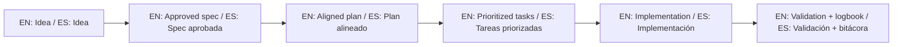

# AI Operating Rules for This Repository

## Mandatory interpretation rule

Always treat this repository as a template base, not as an active product backlog.

Siempre trata este repositorio como una base template, no como un backlog activo de producto.

## AI behavior contract / Contrato de comportamiento para IA

1. Confirm template context first.
2. Ask or infer the real target project path (new project or existing one).
3. Use this repository's guides as source of truth for process and structure.
4. Apply outputs to the target project context, not to this template unless the user asks to improve the template itself.
5. Keep bilingual clarity when possible (English and Spanish).

## Session opening checklist for AI

- State the active mode: template improvement vs project execution using the template.
- Confirm expected outcome: first idea, first spec, first logbook entry, and next step.
- Follow mandatory reading order from `AGENTS.md`.

## Non-negotiables

- No implementation without a specification in the target project.
- No scope changes without refinement trace (`history.md`, `INDEX.md`, `bitacora/`).
- No ambiguity about whether work is for the template or for a user project.

## 🌐 Bilingual support / Soporte bilingüe

- EN: This repository is designed to be used in English and Spanish.
- ES: Este repositorio está diseñado para usarse en inglés y español.
- EN: Keep instructions simple, direct, and copy/paste-ready.
- ES: Mantén instrucciones simples, directas y listas para copiar/pegar.

## 🗣️ Prompt base / Base prompt

```text
EN: Using https://github.com/juanklagos/spec-driven-development-template, guide me step by step with SDD for my project.
My project is: [describe project in plain language].
Do not skip idea, spec, plan, tasks, logbook, and validation.

ES: Usando https://github.com/juanklagos/spec-driven-development-template, guíame paso a paso con SDD para mi proyecto.
Mi proyecto es: [explica el proyecto en lenguaje simple].
No omitas idea, spec, plan, tasks, bitácora y validación.
```

## 💡 Tips / Consejos

- EN: Ask the AI to confirm the active spec before coding.
- ES: Pide a la IA confirmar la spec activa antes de programar.
- EN: Keep one clear next step at the end of each session.
- ES: Deja un próximo paso claro al final de cada sesión.
- EN: Prefer simple language and concrete deliverables.
- ES: Prefiere lenguaje simple y entregables concretos.

## 📊 Visual flow / Flujo visual


