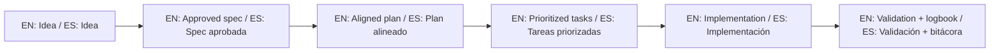

# Anti-Misuse Guide / Guía anti-uso incorrecto

## Common mistakes / Errores comunes

1. Treating this template repository as if it were an active product implementation.
2. Forcing fake active specs in this repository just to satisfy checks.
3. Writing project-specific scope into template-level files without explicit intent.
4. Skipping refinement trace when requirements change.
5. Mixing template maintenance tasks with client project execution tasks in one undocumented flow.

## Corrective actions / Acciones correctivas

- If the task is template maintenance, document changes as template improvements.
- If the task is project execution, switch context to the target project path.
- If context is ambiguous, clarify before implementation.
- Keep this repository as a clean, reusable base for others.

## Quick decision rule / Regla rápida de decisión

- Question: "Is this change improving the template itself, or delivering a concrete user product feature?"
- If template: update template docs/scripts/examples.
- If product feature: execute in the target project repository, using this template as guide.

## 🌐 Bilingual support / Soporte bilingüe

- EN: This repository is designed to be used in English and Spanish.
- ES: Este repositorio está diseñado para usarse en inglés y español.
- EN: Keep instructions simple, direct, and copy/paste-ready.
- ES: Mantén instrucciones simples, directas y listas para copiar/pegar.

## 🗣️ Prompt base / Base prompt

```text
EN: Using https://github.com/juanklagos/spec-driven-development-template, guide me step by step with SDD for my project.
My project is: [describe project in plain language].
Do not skip idea, spec, plan, tasks, logbook, and validation.

ES: Usando https://github.com/juanklagos/spec-driven-development-template, guíame paso a paso con SDD para mi proyecto.
Mi proyecto es: [explica el proyecto en lenguaje simple].
No omitas idea, spec, plan, tasks, bitácora y validación.
```

## 💡 Tips / Consejos

- EN: Ask the AI to confirm the active spec before coding.
- ES: Pide a la IA confirmar la spec activa antes de programar.
- EN: Keep one clear next step at the end of each session.
- ES: Deja un próximo paso claro al final de cada sesión.
- EN: Prefer simple language and concrete deliverables.
- ES: Prefiere lenguaje simple y entregables concretos.

## 📊 Visual flow / Flujo visual


