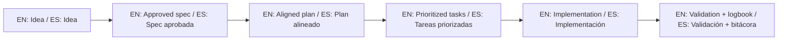

# AI Rules Matrix / Matriz de reglas para IA

This matrix helps apply the same SDD guardrails across multiple AI tools.

## Canonical source

- `template-context/core-instructions/AGENT_OPERATING_SYSTEM.md` (single source of truth)

## Agent mapping

| Agent / Tool | Rule file | Status |
|---|---|---|
| Generic baseline | `INSTRUCTIONS.md` + `sdd.policy.yaml` | Ready |
| Cursor | `.cursorrules` | Ready |
| Claude (Desktop/Code) | `.clauderules` + `CLAUDE.md` | Ready |
| GitHub Copilot | `.github/copilot-instructions.md` | Ready |
| Gemini | `GEMINI.md` | Ready |
| Aider | `AIDER.md` + `template-context/prompts/aider.prompt.md` | Ready |
| Windsurf | `WINDSURF.md` + `template-context/prompts/windsurf.prompt.md` | Ready |
| Roo Code | `ROO.md` + `template-context/prompts/roo.prompt.md` | Ready |
| Generic / Other agents | `template-context/core-instructions/AGENT_OPERATING_SYSTEM.md` | Ready |

## Operational note

If a tool does not support local rule files, paste `template-context/core-instructions/AGENT_OPERATING_SYSTEM.md` as system prompt manually.

Execution workspace note:
- EN: For runnable target projects in this repository, use `www/<project-name>/`.
- ES: Para proyectos ejecutables en este repositorio, usa `www/<nombre-proyecto>/`.

## 🌐 Bilingual support / Soporte bilingüe

- EN: This repository is designed to be used in English and Spanish.
- ES: Este repositorio está diseñado para usarse en inglés y español.
- EN: Keep instructions simple, direct, and copy/paste-ready.
- ES: Mantén instrucciones simples, directas y listas para copiar/pegar.

## 🗣️ Prompt base / Base prompt

```text
EN: Using https://github.com/juanklagos/spec-driven-development-template, guide me step by step with SDD for my project.
My project is: [describe project in plain language].
Do not skip idea, spec, plan, tasks, logbook, and validation.

ES: Usando https://github.com/juanklagos/spec-driven-development-template, guíame paso a paso con SDD para mi proyecto.
Mi proyecto es: [explica el proyecto en lenguaje simple].
No omitas idea, spec, plan, tasks, bitácora y validación.
```

## 💡 Tips / Consejos

- EN: Ask the AI to confirm the active spec before coding.
- ES: Pide a la IA confirmar la spec activa antes de programar.
- EN: Keep one clear next step at the end of each session.
- ES: Deja un próximo paso claro al final de cada sesión.
- EN: Prefer simple language and concrete deliverables.
- ES: Prefiere lenguaje simple y entregables concretos.

## 📊 Visual flow / Flujo visual


