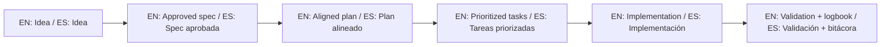

# Framework Readiness Roadmap

This document captures what is missing to evolve this repository from a solid template into a full framework, using GitHub Spec Kit as the main guide.

Este documento captura lo que falta para evolucionar este repositorio desde un template sólido hacia un framework completo, usando GitHub Spec Kit como guía principal.

## Current gap areas / Áreas de brecha actuales

1. Normativa ejecutable / Executable governance
- Convert SDD rules into automated checks, not only documentation.
- Validate spec approval evidence and minimum `spec-plan-tasks` consistency in CI.

2. Flujo oficial GitHub Spec Kit end-to-end / Official GitHub Spec Kit flow
- Standardize one golden path:
  - `constitution -> specify -> plan -> tasks -> implement`
- Provide real examples per project type.

3. Versionado del framework / Framework versioning
- Define semantic versioning for the framework itself.
- Maintain changelog with clear breaking changes.

4. Certificación de calidad / Quality certification
- Create an official SDD compliance score and levels:
  - basic, intermediate, advanced.

5. Adopción multiagente completa / Complete multi-agent adoption
- Keep ready-to-use profiles for major agents.
- Add behavior tests to verify that each agent respects SDD gates.

6. Gobernanza del framework / Framework governance
- Define roadmap ownership and decision process (RFC/ADR).
- Define compatibility and deprecation policy.

## Guiding principle / Principio rector

Always keep GitHub Spec Kit as the reference operating model for the workflow and command sequence.

Mantener siempre GitHub Spec Kit como modelo operativo de referencia para el flujo y la secuencia de comandos.


## 🌐 Bilingual support / Soporte bilingüe

- EN: This repository is designed to be used in English and Spanish.
- ES: Este repositorio está diseñado para usarse en inglés y español.
- EN: Keep instructions simple, direct, and copy/paste-ready.
- ES: Mantén instrucciones simples, directas y listas para copiar/pegar.

## 🗣️ Prompt base / Base prompt

```text
EN: Using https://github.com/juanklagos/spec-driven-development-template, guide me step by step with SDD for my project.
My project is: [describe project in plain language].
Do not skip idea, spec, plan, tasks, logbook, and validation.

ES: Usando https://github.com/juanklagos/spec-driven-development-template, guíame paso a paso con SDD para mi proyecto.
Mi proyecto es: [explica el proyecto en lenguaje simple].
No omitas idea, spec, plan, tasks, bitácora y validación.
```

## 💡 Tips / Consejos

- EN: Ask the AI to confirm the active spec before coding.
- ES: Pide a la IA confirmar la spec activa antes de programar.
- EN: Keep one clear next step at the end of each session.
- ES: Deja un próximo paso claro al final de cada sesión.
- EN: Prefer simple language and concrete deliverables.
- ES: Prefiere lenguaje simple y entregables concretos.

## 📊 Visual flow / Flujo visual


