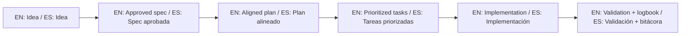

# Spec Kit Standardization Plan

This roadmap defines how to evolve the template into a framework-level standard with GitHub Spec Kit as the primary workflow engine.

Este roadmap define cómo evolucionar el template hacia un estándar de framework con GitHub Spec Kit como motor principal de flujo.

## North Star / Objetivo principal

- EN: Any AI agent should guide users through the same linear SDD path with minimal friction and consistent output quality.
- ES: Cualquier agente de IA debe guiar al usuario por el mismo camino lineal SDD, con mínima fricción y calidad de salida consistente.

## Phase A - Canonical alignment (Now)

Deliverables:

1. Single canonical instruction source for AI behavior.
2. Rule files and CI checks aligned to canonical source.
3. Spec Kit-first initialization path documented and scripted.

Exit criteria:

- No broken references to deprecated instruction files.
- CI validates required SDD rule assets.

## Phase B - Enforcement (Next)

Deliverables:

1. `check-sdd-gate.sh` integrated in local and CI validation flow.
2. Approval evidence required before implementation on approved specs.
3. Minimum `spec` -> `plan` -> `tasks` consistency checks.

Exit criteria:

- CI blocks merges when SDD gate fails.

## Phase C - Multi-agent conformance

Deliverables:

1. Agent profile adapters maintained under `template-context/prompts/`.
2. Shared output contract enforced across tools.
3. Cross-agent handoff checklist required for session transfer.

Exit criteria:

- Same scenario produces equivalent workflow outcome in multiple agents.

## Phase D - Framework governance

Deliverables:

1. Semantic version policy for methodology changes.
2. Release checklist mapped to SDD compliance.
3. Backward compatibility and deprecation rules.

Exit criteria:

- Repeatable, auditable release process for framework updates.

## Suggested KPIs

1. Time to first valid spec.
2. Percentage of sessions with gate compliance before coding.
3. Percentage of specs with full refinement trace.
4. Cross-agent output consistency rate.


## 🌐 Bilingual support / Soporte bilingüe

- EN: This repository is designed to be used in English and Spanish.
- ES: Este repositorio está diseñado para usarse en inglés y español.
- EN: Keep instructions simple, direct, and copy/paste-ready.
- ES: Mantén instrucciones simples, directas y listas para copiar/pegar.

## 🗣️ Prompt base / Base prompt

```text
EN: Using https://github.com/juanklagos/spec-driven-development-template, guide me step by step with SDD for my project.
My project is: [describe project in plain language].
Do not skip idea, spec, plan, tasks, logbook, and validation.

ES: Usando https://github.com/juanklagos/spec-driven-development-template, guíame paso a paso con SDD para mi proyecto.
Mi proyecto es: [explica el proyecto en lenguaje simple].
No omitas idea, spec, plan, tasks, bitácora y validación.
```

## 💡 Tips / Consejos

- EN: Ask the AI to confirm the active spec before coding.
- ES: Pide a la IA confirmar la spec activa antes de programar.
- EN: Keep one clear next step at the end of each session.
- ES: Deja un próximo paso claro al final de cada sesión.
- EN: Prefer simple language and concrete deliverables.
- ES: Prefiere lenguaje simple y entregables concretos.

## 📊 Visual flow / Flujo visual


