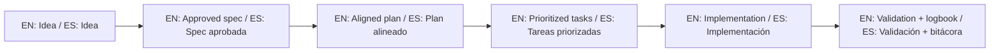

# Template Context Hub

This folder defines the canonical context for this repository as a starter template.

Esta carpeta define el contexto canónico de este repositorio como plantilla de arranque.

## Canonical statement / Declaración canónica

- EN: This repository is not an in-progress product; it is a starter template to quickly bootstrap SDD projects.
- ES: Este repositorio no representa un producto en desarrollo; representa un template para iniciar proyectos con SDD rápidamente.

## Files

1. `core-instructions/AGENT_OPERATING_SYSTEM.md`
2. `01-PURPOSE.md`
3. `02-AI-OPERATING-RULES.md`
4. `03-FAST-ENTRY-FLOWS.md`
5. `04-ANTI-MISUSE.md`
6. `05-SDD-EXECUTION-GATE.md`
7. `06-AI-RULES-MATRIX.md`
8. `07-AI-HANDOFF-CHECKLIST.md`
9. `08-FRAMEWORK-READINESS.md`
10. `09-SPECKIT-STANDARDIZATION-PLAN.md`
11. `prompts/`

## 🌐 Bilingual support / Soporte bilingüe

- EN: This repository is designed to be used in English and Spanish.
- ES: Este repositorio está diseñado para usarse en inglés y español.
- EN: Keep instructions simple, direct, and copy/paste-ready.
- ES: Mantén instrucciones simples, directas y listas para copiar/pegar.

## 🗣️ Prompt base / Base prompt

```text
EN: Using https://github.com/juanklagos/spec-driven-development-template, guide me step by step with SDD for my project.
My project is: [describe project in plain language].
Do not skip idea, spec, plan, tasks, logbook, and validation.

ES: Usando https://github.com/juanklagos/spec-driven-development-template, guíame paso a paso con SDD para mi proyecto.
Mi proyecto es: [explica el proyecto en lenguaje simple].
No omitas idea, spec, plan, tasks, bitácora y validación.
```

## 💡 Tips / Consejos

- EN: Ask the AI to confirm the active spec before coding.
- ES: Pide a la IA confirmar la spec activa antes de programar.
- EN: Keep one clear next step at the end of each session.
- ES: Deja un próximo paso claro al final de cada sesión.
- EN: Prefer simple language and concrete deliverables.
- ES: Prefiere lenguaje simple y entregables concretos.

## 📊 Visual flow / Flujo visual


