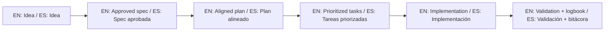

# Template Context Hub

This folder holds the canonical context for the repository: what it is, how an agent should behave inside it, and where the entry flows live. Read it before anything else in the repo.

Esta carpeta contiene el contexto canónico del repositorio: qué es, cómo debe comportarse un agente dentro de él y dónde están los flujos de entrada. Léela antes que cualquier otra cosa.

## Canonical statement / Declaración canónica

- EN: This repository is not an in-progress product; it is a starter template to quickly bootstrap SDD projects.
- ES: Este repositorio no representa un producto en desarrollo; representa un template para iniciar proyectos con SDD rápidamente.

## Files

1. `core-instructions/AGENT_OPERATING_SYSTEM.md`
2. `01-PURPOSE.md`
3. `02-AI-OPERATING-RULES.md`
4. `03-FAST-ENTRY-FLOWS.md`
5. `04-ANTI-MISUSE.md`
6. `05-SDD-EXECUTION-GATE.md`
7. `06-AI-RULES-MATRIX.md`
8. `07-AI-HANDOFF-CHECKLIST.md`
9. `08-FRAMEWORK-READINESS.md`
10. `09-SPECKIT-STANDARDIZATION-PLAN.md`
11. `prompts/`

Read them in that order the first time. The base prompt and the tips live here in the hub so the rest can stay short.

## Bilingual use / Uso bilingüe

Everything here works in English and Spanish. Keep instructions short, direct and ready to paste.

Todo esto funciona en inglés y en español. Mantén las instrucciones cortas, directas y listas para pegar.

## Base prompt / Prompt base

```text
EN: Using https://github.com/juanklagos/spec-driven-development-template, guide me step by step with SDD for my project.
My project is: [describe project in plain language].
Do not skip idea, spec, plan, tasks, logbook, and validation.

ES: Usando https://github.com/juanklagos/spec-driven-development-template, guíame paso a paso con SDD para mi proyecto.
Mi proyecto es: [explica el proyecto en lenguaje simple].
No omitas idea, spec, plan, tasks, bitácora y validación.
```

## Tips / Consejos

- Make the agent say which spec is active before it writes a line of code. / Haz que el agente diga qué spec está activa antes de escribir una línea de código.
- Never end a session without one clear next step. / Nunca cierres una sesión sin un próximo paso claro.
- Plain language and a concrete deliverable beat a clever description. / El lenguaje llano y un entregable concreto le ganan a una descripción ingeniosa.

## The flow / El flujo


