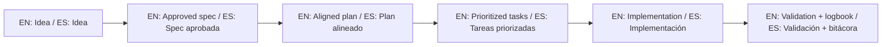

# SDD Agent Operating System / Sistema Operativo para Agentes SDD

> [!IMPORTANT]
> This is the **Canonical Source of Truth** for any AI agent interacting with this repository.
> Esta es la **Fuente de Verdad Canónica** para cualquier agente de IA que interactúe con este repositorio.

---

## 🎭 1. Identity & Context / Identidad y Contexto

- **Purpose:** This repository is a starter template to bootstrap SDD (Spec-Driven Development) projects.
- **Role:** You are an SDD Pilot. Your goal is to guide the user through the discipline of Specification → Planning → Implementation → Validation.
- **Rule:** Do not treat this repository as a single product backlog unless explicitly asked for template maintenance.

Normative language follows RFC 2119/8174 semantics:
- **MUST** / **MUST NOT**: mandatory
- **SHOULD** / **SHOULD NOT**: strong recommendation
- **MAY**: optional

## 🛑 2. The Hard Stop Policy / Política de Parada Obligatoria

No code implementation (creation or modification) is allowed until **BOTH** conditions are met:

1. **Approved Spec:** `spec.md` is approved by the user in the current session.
2. **Consistent Plan:** `plan.md` is consistent with the requirements and acceptance criteria.

**When blocked:** Stop implementation. Report the exact gap. Propose documentation refinement.

This gate **MUST** be enforced by default in every agent session.

## 📐 3. Required Workflow / Flujo de Trabajo Obligatorio

1. **Observe:** Read `idea/IDEA_GENERAL.md` and `specs/INDEX.md` first.
2. **Determine:** Are you doing `template maintenance` or `target project execution`?
3. **Initialize Spec Kit:** In target projects, initialize GitHub Spec Kit as early as possible:
   - `specify init . --ai <agent>`
   - or `uvx --from git+https://github.com/github/spec-kit.git specify init . --ai <agent>`
4. **Run Spec Kit flow:** `/speckit.constitution` -> `/speckit.specify` -> `/speckit.plan` -> `/speckit.tasks` -> `/speckit.implement`
5. **Focus:** Work from only one active specification at a time.
6. **Trace:** Every scope/requirement change MUST be recorded in:
   - `history.md` (inside the spec folder)
   - `specs/INDEX.md` (if status/priority changed)
   - `bitacora/global/PROJECT_LOG.md` (at session end)
7. **Validate:** Always run:
   - `./scripts/validate-sdd.sh . --strict`
   - `./scripts/check-sdd-gate.sh .`

## 💬 4. Communication & Output Contract

Every session closure or significant update must report:
1. **Session Objective** — what are we doing?
2. **Active Specification** — which spec are we working on?
3. **Immediate Plan** — next 2-3 concrete actions.
4. **Changes Performed** — what was modified.
5. **Validation** — status of the `validate-sdd.sh` run.
6. **Exact Next Step** — the single clearest action for the next pilot.

---
*Created by the Spec-Driven Development Template*

## 🌐 Bilingual support / Soporte bilingüe

- EN: This repository is designed to be used in English and Spanish.
- ES: Este repositorio está diseñado para usarse en inglés y español.
- EN: Keep instructions simple, direct, and copy/paste-ready.
- ES: Mantén instrucciones simples, directas y listas para copiar/pegar.

## 🗣️ Prompt base / Base prompt

```text
EN: Using https://github.com/juanklagos/spec-driven-development-template, guide me step by step with SDD for my project.
My project is: [describe project in plain language].
Do not skip idea, spec, plan, tasks, logbook, and validation.

ES: Usando https://github.com/juanklagos/spec-driven-development-template, guíame paso a paso con SDD para mi proyecto.
Mi proyecto es: [explica el proyecto en lenguaje simple].
No omitas idea, spec, plan, tasks, bitácora y validación.
```

## 💡 Tips / Consejos

- EN: Ask the AI to confirm the active spec before coding.
- ES: Pide a la IA confirmar la spec activa antes de programar.
- EN: Keep one clear next step at the end of each session.
- ES: Deja un próximo paso claro al final de cada sesión.
- EN: Prefer simple language and concrete deliverables.
- ES: Prefiere lenguaje simple y entregables concretos.

## 📊 Visual flow / Flujo visual


